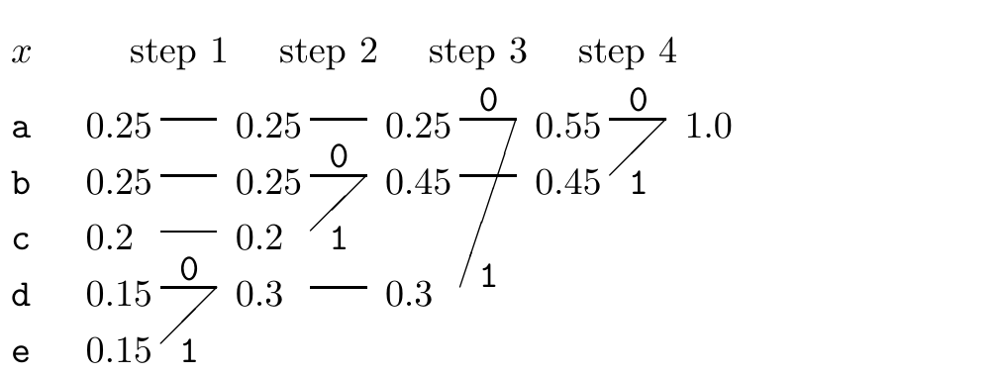

<!-- 源 PDF 物理页 111；原书印刷页 99 -->

### Huffman 编码算法

现在介绍一种非常简洁的最优前缀码算法。诀窍是从码字末端出发，反向构造编码；也就是从叶子开始建二叉树。

**算法 5.4　Huffman 编码算法。**

1. 取字母表中概率最低的两个符号。它们将获得最长且长度相同的两个码字，两个码字仅最后一位不同。
2. 把这两个符号合并成一个符号，重复上述步骤。

每一步都会使字母表大小减少 1，所以经过 $|\mathcal A_X|-1$ 步，就会为所有符号分配好字符串。

**例 5.15。** 设 $\mathcal A_X=\{a,b,c,d,e\}$，$\mathcal P_X=\{0.25,0.25,0.2,0.15,0.15\}$。

图内列标题 $x$、*step 1–4* 分别表示“符号”和“第 1–4 步”。每条合并线旁的 $0$ 或 $1$ 是反向生成码字时接入的二进制位：先把概率均为 $0.15$ 的 d、e 合成 $0.3$，再把 c 与 $0.25$ 的 b 合成 $0.45$，接着把 a 与 $0.3$ 合成 $0.55$，最后把 $0.45$ 与 $0.55$ 合成 $1.0$。

随后按反向顺序连接二进制数字，得到码字 $C=\{00,10,11,010,011\}$。Huffman 算法选出的码长（表 5.5 的第 4 列），有些比理想码长——香农信息量 $\log_2(1/p_i)$（第 3 列）——长，有些则更短。该码的期望长度 $L=2.30$ 比特，而熵 $H=2.2855$ 比特。□

**表 5.5　Huffman 算法构造的编码。**

| 符号 $a_i$ | 概率 $p_i$ | 信息量 $h(p_i)$ | 码长 $l_i$ | 码字 $c(a_i)$ |
|:---:|:---:|:---:|:---:|:---:|
| a | 0.25 | 2.0 | 2 | `00` |
| b | 0.25 | 2.0 | 2 | `10` |
| c | 0.2 | 2.3 | 2 | `11` |
| d | 0.15 | 2.7 | 3 | `010` |
| e | 0.15 | 2.7 | 3 | `011` |

如果某一步中选取概率最低的两个符号有不止一种方式，任意选取即可；码的期望长度不会因选择而改变。

**习题 5.16**〔难度 3；解答见原书印刷页 105〕证明：对一个信源，不存在比 Huffman 码更好的符号码。

**例 5.17。** 我们可以为图 2.1 中的字母概率分布构造 Huffman 码，结果见图 5.6。该码的期望长度是 4.15 比特，系综的熵是 4.11 比特。请比较分配的码长与理想码长 $\log_2(1/p_i)$ 之间的差异。

### 自顶向下构造二叉树并非最优

前几章研究过构造三叉或二叉树的称重问题。我们注意到，**平衡的树**——每一步两个可能结果都尽量等概率的树——看起来对应最有效的实验。这为用熵度量信息量提供了直观理由。
