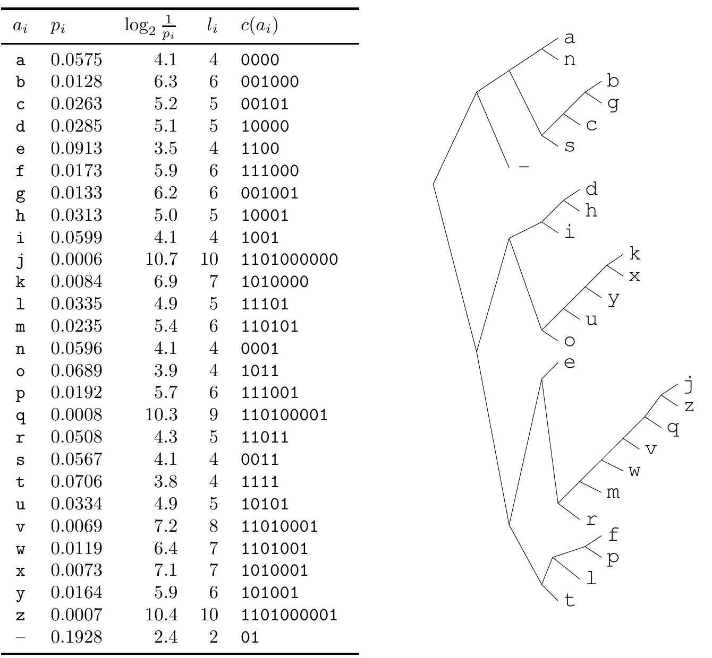

<!-- 源 PDF 物理页 112；原书印刷页 100 -->

图 5.6　英语系综（单字母统计）的 Huffman 码。左侧五列依次为符号 $a_i$、概率 $p_i$、理想信息量 $\log_2(1/p_i)$、实际码长 $l_i$ 和码字 $c(a_i)$；右侧是对应的编码树。横线代表空格。完整数值如下：

| 符号 | $p_i$ | $\log_2(1/p_i)$ | $l_i$ | $c(a_i)$ |
|:---:|:---:|:---:|:---:|:---:|
| a | 0.0575 | 4.1 | 4 | `0000` |
| b | 0.0128 | 6.3 | 6 | `001000` |
| c | 0.0263 | 5.2 | 5 | `00101` |
| d | 0.0285 | 5.1 | 5 | `10000` |
| e | 0.0913 | 3.5 | 4 | `1100` |
| f | 0.0173 | 5.9 | 6 | `111000` |
| g | 0.0133 | 6.2 | 6 | `001001` |
| h | 0.0313 | 5.0 | 5 | `10001` |
| i | 0.0599 | 4.1 | 4 | `1001` |
| j | 0.0006 | 10.7 | 10 | `1101000000` |
| k | 0.0084 | 6.9 | 7 | `1010000` |
| l | 0.0335 | 4.9 | 5 | `11101` |
| m | 0.0235 | 5.4 | 6 | `110101` |
| n | 0.0596 | 4.1 | 4 | `0001` |
| o | 0.0689 | 3.9 | 4 | `1011` |
| p | 0.0192 | 5.7 | 6 | `111001` |
| q | 0.0008 | 10.3 | 9 | `110100001` |
| r | 0.0508 | 4.3 | 5 | `11011` |
| s | 0.0567 | 4.1 | 4 | `0011` |
| t | 0.0706 | 3.8 | 4 | `1111` |
| u | 0.0334 | 4.9 | 5 | `10101` |
| v | 0.0069 | 7.2 | 8 | `11010001` |
| w | 0.0119 | 6.4 | 7 | `1101001` |
| x | 0.0073 | 7.1 | 7 | `1010001` |
| y | 0.0164 | 5.9 | 6 | `101001` |
| z | 0.0007 | 10.4 | 10 | `1101000001` |
| 空格 | 0.1928 | 2.4 | 2 | `01` |

但是，最优码并非总能用贪心式的自顶向下方法构造出来，即每一步都把字母表分成概率尽可能接近的两个子集。

**例 5.18。** 求以下系综的最优二元符号码：

$$\begin{aligned}\mathcal A_X&=\{a,b,c,d,e,f,g\},\\\mathcal P_X&=\{0.01,0.24,0.05,0.20,0.47,0.01,0.02\}.\end{aligned}\tag{5.24}$$

注意，贪心式自顶向下方法可以把集合分为 $\{a,b,c,d\}$ 与 $\{e,f,g\}$，两者概率均为 $1/2$；前一集合还能分成 $\{a,b\}$ 与 $\{c,d\}$，两者概率均为 $1/4$。因此，这种方法得到表 5.7 第 3 列的码，期望长度为 2.53。Huffman 算法得到第 4 列的码，期望长度为 1.97。□

**表 5.7　贪心构造的编码与 Huffman 码的比较。**

| 符号 $a_i$ | 概率 $p_i$ | 贪心码 | Huffman 码 |
|:---:|:---:|:---:|:---:|
| a | 0.01 | `000` | `000000` |
| b | 0.24 | `001` | `01` |
| c | 0.05 | `010` | `0001` |
| d | 0.20 | `011` | `001` |
| e | 0.47 | `10` | `1` |
| f | 0.01 | `110` | `000001` |
| g | 0.02 | `111` | `00001` |

## 5.6 Huffman 码的缺点

Huffman 算法为一个系综生成最优符号码，但事情并未到此结束。“系综”和“符号码”两个说法都值得细究。

### 系综变化

如果要传输来自一个始终不变的系综的一系列结果，Huffman 码也许很方便。但合适的
