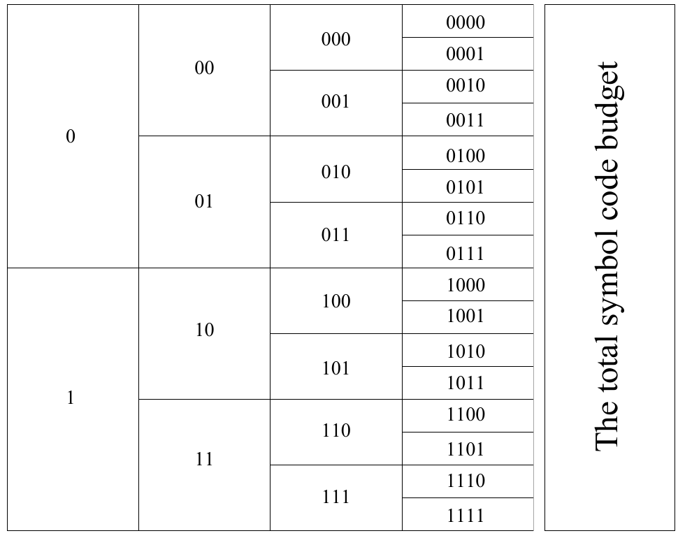
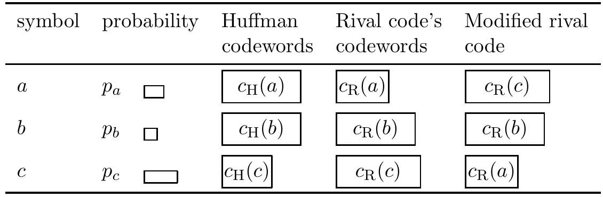

<!-- 源 PDF 物理页 117；原书印刷页 105 -->

图 5.8　码字超市与符号编码预算。每个长度为 $l$ 的码字的“价格”是 $2^{-l}$，用写有该码字的方框面积表示。构造唯一可译码的总预算是 1。竖排英文 *The total symbol code budget* 意为“符号码的总预算”。图中每一层列出该长度的全部二进制码字，从长度 1 的 $0,1$，到长度 4 的 $0000,\ldots,1111$。

图 5.9　Huffman 编码生成最优符号码的证明。图内表头依次为“符号”“概率”“Huffman 码字”“竞争码的码字”“修改后的竞争码”。假设某个自称最优的竞争码，给概率最低的两个符号 $a,b$ 分配不等长码字。把竞争码中 $a$ 与另一符号 $c$ 的码字交换；$c$ 的码长至少与 $b$ 一样长，却比 $a$ 更可能出现。交换会得到比原竞争码更好的码，从而说明原竞争码并非最优。图内三行概率为 $p_a,p_b,p_c$，修改后 $a,b,c$ 的码字分别为 $c_{\mathrm R}(c),c_{\mathrm R}(b),c_{\mathrm R}(a)$。

上面习题 5.14 的证明接着说：从超市的一侧（比如顶部）开始，购买第一个符合所需长度的码字。然后沿超市向下移动 $2^{-l}$ 的距离，购买下一个所需长度的码字，依此类推。码字长度逐渐增大，相应区间逐渐缩小，因此总能买到与上次购买位置相邻的码字，不会浪费预算。买到第 $I$ 个码字时，沿超市移动的总距离为 $\sum_{i=1}^{I}2^{-l_i}$；如果 $\sum_i2^{-l_i}\leq1$，就能在预算用尽之前买齐所有码字。

**习题 5.16 的解答**（原书印刷页 99）。要证明 Huffman 编码最优，关键是证明算法中的这一步：把概率最低的两个符号赋予相同码长，不可能比其他码产生更大的期望长度。可用反证法。

设概率最低的两个符号为 $a,b$，Huffman 算法会给它们长度相同的码字；假设**任何**最优符号码都不给它们相同长度。于是某个最优码必是另一种竞争码，其中这两个码字的长度 $l_a\ne l_b$；不失一般性，设 $l_a<l_b$。还可不失一般性地假设此竞争码是完备前缀码，因为唯一可译码的任何一组码长都能由前缀码实现。

在该竞争码中，必有另一符号 $c$，其概率 $p_c$ 大于 $p_a$，而在竞争码中的长度不小于 $l_b$；这是因为 $b$ 的码字旁边必须有一个长度相等或更长的相邻码字——完备前缀码不会只有一个最长码字。

考虑交换 $a$ 和 $c$ 的码字（图 5.9），使 $a$
