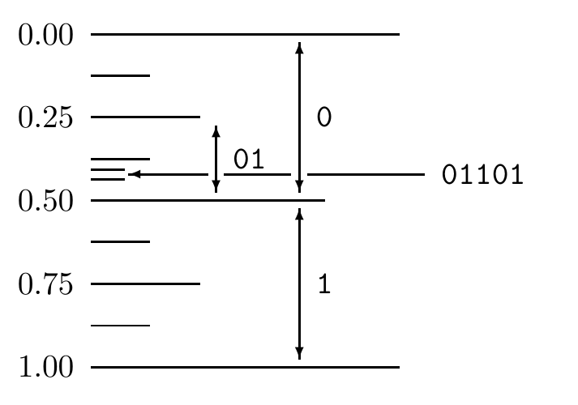
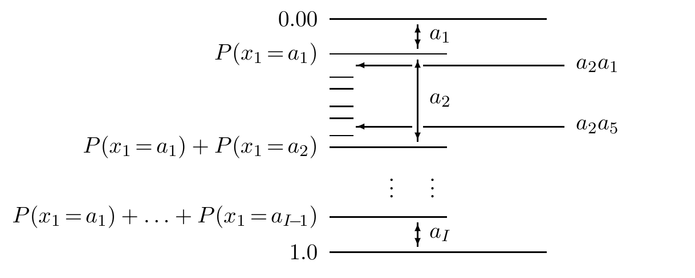

<!-- 源 PDF 物理页 124；原书印刷页 112 -->

$P(x_n=a_i\mid x_1,\ldots,x_{n-1})$。接收方也有一个完全相同的程序，能给出同样的预测概率分布 $P(x_n=a_i\mid x_1,\ldots,x_{n-1})$。

图 6.1　二进制串在实数线的 $[0,1)$ 内确定实数区间。我们在第 5 章讨论“码字超市”时第一次见过类似的图。图内标出的 `0`、`1` 是第一个二进制位的两个半区间，`01` 是其中继续细分的区间，`01101` 对应更窄的区间；左边列出 0.00、0.25、0.50、0.75、1.00 的位置。

### 理解算术编码所需的概念

**区间记法。** 区间 $[0.01,0.10)$ 包含 0.01 到 0.10 之间的全部数，包括二进制的 $0.01\dot0\equiv0.01000\ldots$，但不包括 $0.10\dot0\equiv0.10000\ldots$。

一次二进制传输会在 0 到 1 的实数线上确定一个区间。例如，把字符串 `01` 解释为二进制实数 $0.01\ldots$，对应二进制区间 $[0.01,0.10)$，也就是十进制区间 $[0.25,0.50)$。

较长的字符串 `01101` 对应较小的区间 $[0.01101,0.01110)$。由于 `01101` 以 `01` 为前缀，新区间是 $[0.01,0.10)$ 的子区间。这样，一个一兆字节的二进制文件（$2^{23}$ 比特）就可以看作把 0 到 1 之间的一个数指定到约两百万位十进制精度。之所以约为两百万个十进制数字，是因为每个字节对应略多于两个十进制数字。

还可以如图 6.2 所示，把实数线上的 $[0,1)$ 分成 $I$ 个区间，每个区间长度等于相应的概率 $P(x_1=a_i)$。

图 6.2　概率模型在实数线 $[0,1)$ 内确定实数区间。图内 $a_1,a_2,\ldots,a_I$ 标出首个符号的区间；左侧 $P(x_1=a_1)$、$P(x_1=a_1)+P(x_1=a_2)$ 等是累积边界；右侧 $a_2a_1$ 和 $a_2a_5$ 显示区间 $a_2$ 还可继续细分。

随后可把每个区间 $a_i$ 再细分为 $a_i a_1,a_i a_2,\ldots,a_i a_I$，使 $a_i a_j$ 的长度与 $P(x_2=a_j\mid x_1=a_i)$ 成正比。实际上，区间 $a_i a_j$ 的长度恰好是联合概率

$$P(x_1=a_i,x_2=a_j)=P(x_1=a_i)P(x_2=a_j\mid x_1=a_i).\tag{6.1}$$

反复进行这个过程，就可把区间 $[0,1)$ 逐步划分为与所有有限长度字符串 $x_1x_2\cdots x_N$ 对应的区间；每个区间的长度等于模型给这个字符串的概率。
