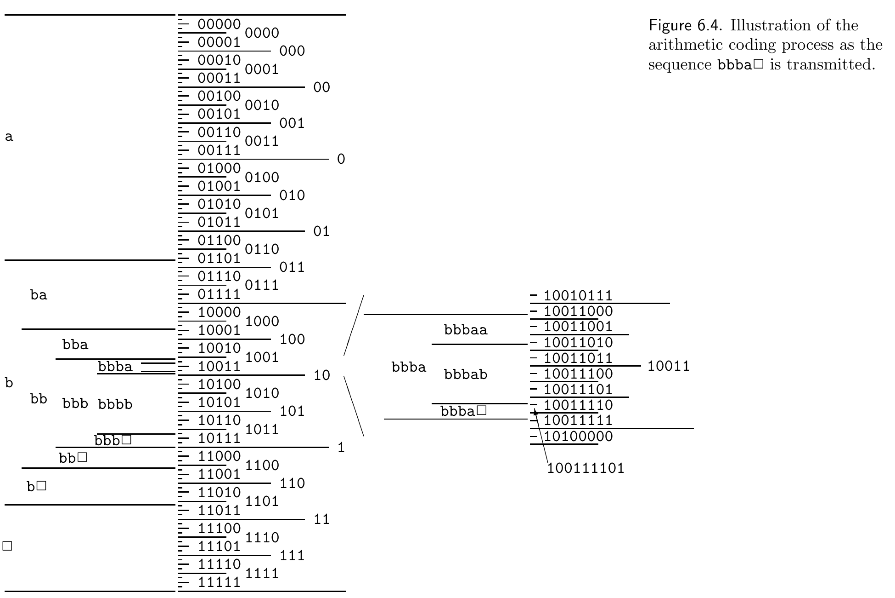

<!-- 源 PDF 物理页 126；原书印刷页 114 -->

这些概率为：

| 上下文（截至目前的序列） | 下一个符号为 `a` 的概率 | 下一个符号为 `b` 的概率 | 下一个符号为 `□` 的概率 |
|:---|:---:|:---:|:---:|
| 空串 | $P(a)=0.425$ | $P(b)=0.425$ | $P(□)=0.15$ |
| `b` | $P(a\mid b)=0.28$ | $P(b\mid b)=0.57$ | $P(□\mid b)=0.15$ |
| `bb` | $P(a\mid bb)=0.21$ | $P(b\mid bb)=0.64$ | $P(□\mid bb)=0.15$ |
| `bbb` | $P(a\mid bbb)=0.17$ | $P(b\mid bbb)=0.68$ | $P(□\mid bbb)=0.15$ |
| `bbba` | $P(a\mid bbba)=0.28$ | $P(b\mid bbba)=0.57$ | $P(□\mid bbba)=0.15$ |

图 6.4 显示对应区间。区间 `b` 是 $[0,1)$ 中间的 0.425 部分；区间 `bb` 是 `b` 的中间 0.567 部分，依此类推。

图 6.4　传输序列 `bbba□` 时的算术编码过程。图内左侧的 `a`、`b`、`□` 是首个信源符号对应的区间，随后标出 `bb`、`bbb`、`bbba`、`bbba□` 等逐层细分的区间；中央二进制标记是相应的二进制区间。右侧放大 `bbba□` 附近的区间，标出选取的 `100111101`。图片原有英文图注意为“序列 `bbba□` 被传输时算术编码过程的示意”。

观察到第一个符号 `b` 时，编码器知道二进制串会以 `01`、`10` 或 `11` 开头，但还不知道是哪一个。因此它暂时不写出任何位，继续看下一个符号 `b`。区间 `bb` 完全处于区间 `1` 内，所以编码器可以写下第一位 `1`。第三个符号 `b` 又把区间缩小了一些，但还不足以使它完全落入区间 `10`。直到从信源读到下一个符号 `a`，编码器才可以再发送一些位：区间 `bbba` 完全落在区间 `1001` 内，所以它在已经写出的 `1` 后附加 `001`。最后，`□` 到来时，需要一种终止编码的程序。把区间 `bbba□` 放大来看（图 6.4 右侧），标出的二进制区间 `100111101` 完全包含在 `bbba□` 内。因此，再附加 `11101`，编码就完成了。
