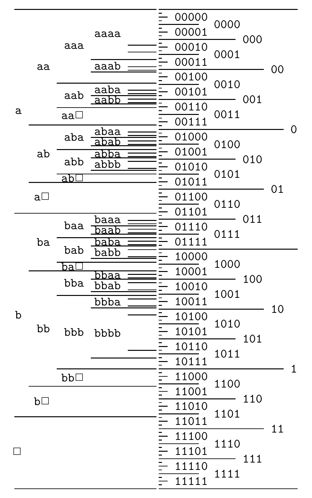

<!-- 源 PDF 物理页 128；原书印刷页 116 -->

图 6.5　一个简单贝叶斯概率模型所确定的区间。区间大小与字符串概率成正比。模型预计信源可能偏向 `a` 或 `b` 中的某一个，所以 `a` 很多或 `b` 很多的序列，比同样长度却由 `a`、`b` 各占一半的序列拥有更大的区间。图内从左向右标出最长为五个字符的信源前缀、对应的区间及其二进制区间；`□` 是结束符号。

图 6.4 用一个简单模型绘制：它始终给结束符 `□` 分配 0.15 的概率，再把余下的 0.85 分给 `a` 和 `b`；两者比例由拉普拉斯法则给出：

$$P_{\mathrm L}(a\mid x_1,\ldots,x_{n-1})=\frac{F_a+1}{F_a+F_b+2},\tag{6.7}$$

其中，$F_a(x_1,\ldots,x_{n-1})$ 是到目前为止 `a` 出现的次数，$F_b$ 是 `b` 的次数。这些预测对应一个简单的贝叶斯模型：它预期并适应文件内 `a` 和 `b` 使用频率不相等的情况。

图 6.5 显示了若干长度最多为五的字符串所对应的区间。请注意，如果截至目前的字符串含有许多 `b`，那么 `b` 相对于 `a` 的概率就会上升；反过来，如果出现了许多 `a`，`a` 的概率就会上升。记住，较大的区间需要较少的比特来编码。

### 贝叶斯模型的细节

前面强调过：算术编码可以采用任何模型，并不依赖某一组特定概率。现在说明上例使用的简单自适应概率模型。
