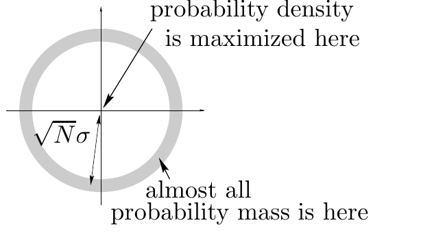

<!-- 源 PDF 物理页 137；原书印刷页 125 -->

假定 $N$ 很大，证明高斯分布的几乎全部概率都集中在半径为 $\sqrt N\sigma$ 的薄壳内，并求壳的厚度。

计算式 (6.13) 的概率密度在薄壳中某一点及原点 $\mathbf x=0$ 处的值，并作比较。以 $N=1000$ 为例。

请注意：几乎全部概率质量所在的区域，与概率密度最高的区域并不相同。

图 6.8　$N$ 维高斯分布典型集的示意。图中灰色薄壳的半径为 $\sqrt N\sigma$。英文标注 *probability density is maximized here* 意为“这里的概率密度最大”（指原点），*almost all probability mass is here* 意为“几乎全部概率质量位于这里”（指薄壳）。

**习题 6.15**〔难度 2〕解释“最优二元符号码”的含义。为以下系综找出一个最优二元符号码，并计算其期望长度：

$$\mathcal A=\{a,b,c,d,e,f,g,h,i,j\},$$

$$\mathcal P=\left\{\frac1{100},\frac2{100},\frac4{100},\frac5{100},\frac6{100},\frac8{100},\frac9{100},\frac{10}{100},\frac{25}{100},\frac{30}{100}\right\}.$$

**习题 6.16**〔难度 2〕字符串 $\mathbf y=x_1x_2$ 由下列系综的两个独立样本组成：

$$X:\quad\mathcal A_X=\{a,b,c\};\quad\mathcal P_X=\left\{\frac1{10},\frac3{10},\frac6{10}\right\}.$$

$\mathbf y$ 的熵是多少？为 $\mathbf y$ 构造一个最优二元符号码，并求其期望长度。

**习题 6.17**〔难度 2〕一个系综的概率分布为 $\mathcal P=\{0.1,0.9\}$。从该系综独立抽取 $N$ 个样本形成字符串，再使用与该系综匹配的算术码压缩。当 $N=1000$ 时，估计压缩串长度的均值和标准差。［$H_2(0.1)\simeq0.47$。］

**习题 6.18**〔难度 3〕使用变长符号进行信源编码。

前面讨论信源编码时，假定编码字母表为二元集合 $\{0,1\}$，其中两个符号应以相同频率使用。本题研究：如果符号的传输时间不同，应如何使用编码字母表。

一位囊中羞涩的学生通过电话免费与朋友交流：每次选一个整数 $n\in\{1,2,3,\ldots\}$，让朋友的电话响 $n$ 次，然后在第 $n$ 次铃声响到一半时挂断。反复如此，朋友便收到符号序列 $n_1n_2n_3\cdots$。怎样通信最有效？如果选较大的整数 $n$，传送消息会更耗时；如果只用较小的 $n$，每个符号的信息量又很低。目标是最大化单位时间的信息传输速率。

假定传送 $n$ 次铃响并重新拨号需要 $l_n$ 秒。考虑 $n$ 上的概率分布 $\{p_n\}$，定义每个符号的平均耗时为

$$L(\mathbf p)=\sum_n p_n l_n.\tag{6.15}$$
