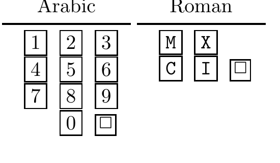

<!-- 源 PDF 物理页 139；原书印刷页 127 -->

**习题 6.21**〔难度 2〕我的旧式“阿拉伯数字”微波炉有 11 个用于输入烹饪时间的按钮，新式“罗马数字”微波炉只有 5 个。罗马数字微波炉的按钮分别标为“10 分钟”“1 分钟”“10 秒”“1 秒”和“开始”；下面用符号 `M`、`C`、`X`、`I`、`□` 简写。要输入 1 分 23 秒（`1:23`），阿拉伯数字键盘上的按键序列是

$$\text{123□},\tag{6.21}$$

罗马数字键盘上的按键序列是

$$\text{CXXIII□}.\tag{6.22}$$

图 6.9　微波炉的两种键盘。图内 *Arabic* 意为“阿拉伯数字式”，左侧为数字 0–9 加“开始”键 `□`；*Roman* 意为“罗马数字式”，右侧为 `M`、`C`、`X`、`I` 和“开始”键 `□`。

这两种键盘各自定义了一种编码：把从 `0:01` 到 `59:59` 的 3599 种烹饪时间，映射为一串按键符号。

(a) 哪些时间可以用两个或三个符号输入？（例如，两种编码都可用三个符号输入 `0:20`：`XX□` 和 `20□`。）

(b) 这两种码是完备的吗？请详细作答。

(c) 对每种码，举出一个它可用四个符号输入、另一种码却不能用四个符号输入的烹饪时间。

(d) 讨论两种码各自最适合哪一种隐含的烹饪时间概率分布。

(e) 设想真实使用者可能采用的一种合理烹饪时间概率分布，粗略计算两种码各自所需符号数的期望值和最大值，并讨论它们在哪些方面高效或低效。

(f) 发明一种输入烹饪时间更高效的微波炉编码系统。

**习题 6.22**〔难度 2；解答见原书印刷页 132〕正整数的标准二进制表示（例如 $c_b(5)=101$）是唯一可译码吗？

设计一种正整数的二元码，即从 $n\in\{1,2,3,\ldots\}$ 到 $c(n)\in\{0,1\}^+$ 的唯一可译映射。试着设计既是前缀码又满足 Kraft 等式 $\sum_n2^{-l_n}=1$ 的码。

这样做的动机是：任何以特殊文件结束符结尾的数据文件都可以映射成一个整数，因此整数前缀码也能用于文件的自定界编码。大文件对应大整数。此外，“通用”编码方案——即适用于多种信源的编码方案——的一项基础能力就是编码整数。最后，微波炉的烹饪时间也是正整数！

讨论可以用哪些标准来比较不同的整数编码（等价地，也就是比较不同的文件自定界编码）。

## 6.9 解答

**习题 6.1 的解答**（原书印刷页 115）。最坏的情形是：待表示的区间刚好处在某个二进制区间的内侧。这时，如图 6.10 所示，可以在两个二进制区间中任选一个。
