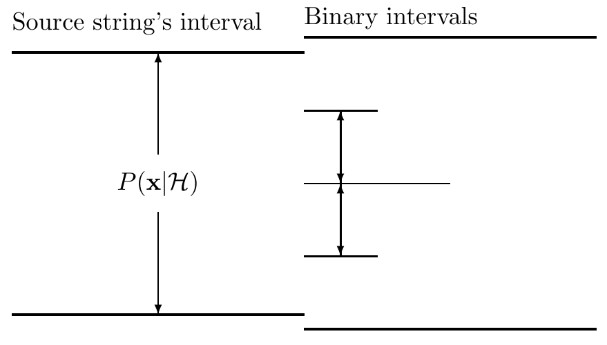

<!-- 源 PDF 物理页 140；原书印刷页 128 -->

图 6.10　最坏情况下终止算术编码，需要额外两比特。右侧标出的两个二进制区间可以任选一个；其长度均不小于 $P(\mathbf x\mid\mathcal H)/4$。图内 *Source string’s interval* 意为“信源串的区间”，*Binary intervals* 意为“二进制区间”。

这些二进制区间都不小于 $P(\mathbf x\mid\mathcal H)/4$，因此二进制编码的长度不超过 $\log_2[1/P(\mathbf x\mid\mathcal H)]+\log_2 4$，即只比理想消息长度多两比特。

**习题 6.3 的解答**（原书印刷页 118）。标准方法每生成一个符号使用 32 个随机比特，所以生成一千个样本需要 32,000 比特。

算术编码平均每个符号使用约 $H_2(0.01)=0.081$ 比特，因此生成一千个样本需要约 83 比特（假定终止编码大约额外耗费两比特）。

1 的个数发生波动时，这个均值附近的结果也会波动，标准差为 21。

**习题 6.5 的解答**（原书印刷页 120）。编码结果为 `010100110010110001100`，对应以下切分：

$$0,\ 00,\ 000,\ 0000,\ 001,\ 00000,\ 000000.\tag{6.23}$$

各子串编码为

$$\text{(,0)},\ (1,0),\ (10,0),\ (11,0),\ (010,1),\ (100,0),\ (110,0).\tag{6.24}$$

**习题 6.6 的解答**（原书印刷页 120）。解码结果为 `0100001000100010101000001`。

**习题 6.8 的解答**（原书印刷页 123）。本题等价于习题 6.7（原书印刷页 123）。

从 $N$ 个物体中选出 $K$ 个，需要 $\lceil\log_2\binom NK\rceil$ 比特，约为 $NH_2(K/N)$ 比特。可以用算术编码作这种选择：用长度为 $N$ 的二进制串表示选取结果，第 1 位代表第 1 个物体是否被选中，依此类推。最初，输出 1 的概率为 $K/N$，输出 0 的概率为 $(N-K)/N$。其后，若已经输出的 $n$ 位中有 $k$ 个 1，则下一个符号为 1 的概率为 $(K-k)/(N-n)$，为 0 的概率为 $1-(K-k)/(N-n)$。

**习题 6.12 的解答**（原书印刷页 124）。这种改进的 Lempel–Ziv 码仍不“完备”。例如，收集了五个前缀后，指针可以是 `000`、`001`、`010`、`011`、`100` 中的任何一个，却不可能是 `101`、`110` 或 `111`。所以某些二进制串不可能作为编码结果出现。

**习题 6.13 的解答**（原书印刷页 124）。下列信源的熵很低，却不能被 Lempel–Ziv 很好地压缩：
