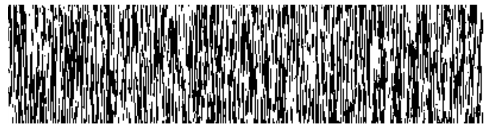

<!-- 源 PDF 物理页 141；原书印刷页 129 -->

(a) 某些符号具有长距离关联、但中间夹杂随机杂项的信源。理想模型应识别关联部分并将其压缩；Lempel–Ziv 却只能记住中间随机杂项的每一种情况，才能压缩相关特征。一个简单例子是电话簿，每行包含一对（旧号码，新号码）：

```text
285-3820:572-5892□
258-8302:593-2010□
```

每行 18 个字符，取自含 13 个字符的字母表 $\{0,1,\ldots,9,-,:,□\}$。字符 `-`、`:`、`□` 依可预测的顺序出现，因此假设每个电话号码都是七位随机数字，每行的真实信息量约为 14 ban。（1 ban 是 0 到 9 中一个随机整数的信息量。）有限状态语言模型很容易捕捉这些数据的规律。可是 Lempel–Ziv 算法要过很长时间，才能把这类文件压到每行 14 ban：因为要让它“学会”任意三个数字组成的 `:ddd` 后面总是跟着 `-`，它必须见过所有这些字符串。只有读入几千行数据后，压缩效果才会接近最优。



图 6.11　一个低熵、却不能被 Lempel–Ziv 很好压缩的信源。比特序列按从左到右的顺序读取；每一行有 $f=5\%$ 的比特与上一行不同。图像宽 400 像素。

(b) 有长距离关联的信源。例如，用逐行扫描的像素序列表示二维图像：上下相邻的像素在信源流中相隔 $w$ 个位置，其中 $w$ 是图像宽度。以传真为例，每一行与上一行十分相似（图 6.11）。真正的熵仅为每像素 $H_2(f)$，其中 $f$ 是一个像素与其上一行对应像素不同的概率。Lempel–Ziv 算法只有见过所有长度为 $2^w=2^{400}$ 的字符串并记住它们的后续字符后，才可能把数据压到熵。宇宙中大约只有 $2^{300}$ 个粒子，所以可以肯定：Lempel–Ziv 码永远无法捕捉这类图像中的冗余。

图 6.12 显示另一种高度冗余的纹理。图像由随机落在平面上的水平和垂直细针形成，既有长距离的纵向关联，也有长距离的横向关联。如果把这幅图像逐像素扫描后交给 Lempel–Ziv，它实际上无法同时捕捉两类关联。

生物计算系统很容易识别这些图像以及更复杂图像中的冗余；因此可以预期，最好的数据压缩算法将来自人工智能方法的发展。
