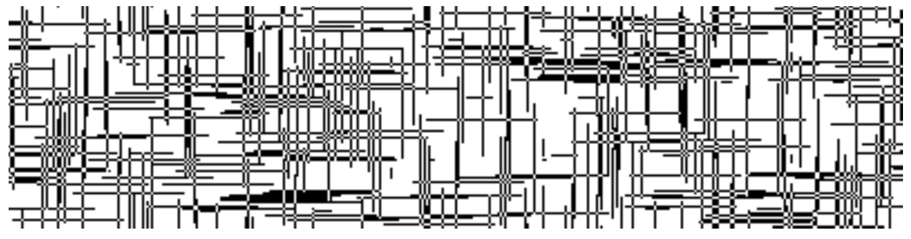
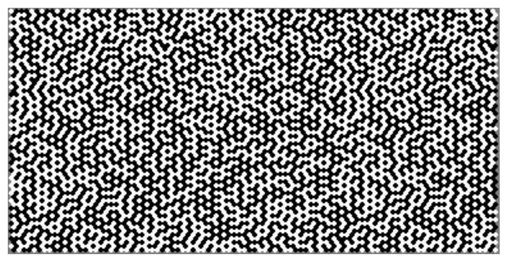

<!-- 源 PDF 物理页 142；原书印刷页 130 -->

图 6.12　随机落在平面上的水平和垂直细针组成的纹理。

(c) 具有复杂冗余的信源，例如由计算机生成的文件。比如一个 $\mathrm{\LaTeX}$ 文件，后面接着该文件编码生成的 PostScript 文件。这两个文件合起来的信息量，大致等于单独那个 $\mathrm{\LaTeX}$ 文件的信息量。

(d) Mandelbrot 集的图像。其信息量等于指定所研究的复平面范围、像素大小和着色规则所需的比特数。

(e) 受挫反铁磁 Ising 模型某个基态的图像（图 6.13），第 31 章还会讨论它。与图 6.12 一样，这幅二值图像在两个方向上都有有趣的关联。

图 6.13　受挫三角格点 Ising 模型的一个基态。

(f) 元胞自动机。图 6.14 展示一个有 400 个元胞的自动机在 100 步中的状态历史。更新规则是随机选出的：每个元胞的新状态取决于之前五个元胞的状态。其信息量等于边界条件中的信息（400 比特）加上演化规则中的信息；这里的规则可用 32 比特描述。因此，最优压缩器产生的文件长度基本为常数，与图像的纵向高度无关。Lempel–Ziv 只有等到元胞自动机进入周期性的极限环，才会实现这种零新增成本的压缩；这可能轻易需要约 $2^{100}$ 次迭代。

相比之下，JBIG 压缩方法根据像素的局部上下文对其概率建模，并使用算术编码，因此能很好地压缩这些图像。

**习题 6.14 的解答**（原书印刷页 124）。对一维高斯变量，$x$ 的方差 $\mathbb E[x^2]$ 为 $\sigma^2$。由于 $\mathbf x$ 的各分量是独立随机变量，$N$ 维情况下 $r^2$ 的均值为

$$\mathbb E[r^2]=N\sigma^2.\tag{6.25}$$
