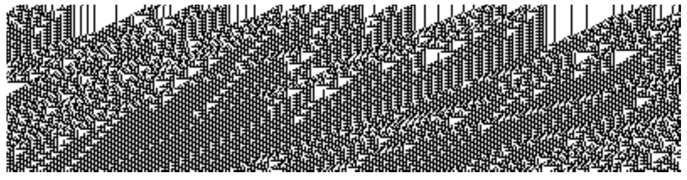

<!-- 源 PDF 物理页 143；原书印刷页 131 -->

图 6.14　含 400 个元胞的元胞自动机在 100 步中的状态历史。

类似地，$r^2$ 的方差是一维高斯变量 $x$ 的 $x^2$ 方差的 $N$ 倍：

$$\operatorname{var}(x^2)=\int dx\,\frac{1}{(2\pi\sigma^2)^{1/2}}x^4\exp\left(-\frac{x^2}{2\sigma^2}\right)-\sigma^4.\tag{6.26}$$

由式 (6.14)，积分等于 $3\sigma^4$，所以 $\operatorname{var}(x^2)=2\sigma^4$。因此，$r^2$ 的方差为 $2N\sigma^4$。

当 $N$ 很大时，中心极限定理表明 $r^2$ 近似服从高斯分布，均值为 $N\sigma^2$，标准差为 $\sqrt{2N}\sigma^2$。因此，$r$ 的概率密度也必然集中在 $r\simeq\sqrt N\sigma$ 附近。

将 $r^2$ 的标准差换算为 $r$ 的标准差，就得到薄壳的厚度：当 $\delta r/r$ 很小时，$\delta\log r=\delta r/r=(1/2)\delta\log r^2=(1/2)\delta(r^2)/r^2$。所以令 $\delta(r^2)=\sqrt{2N}\sigma^2$，便得到 $r$ 的标准差

$$\delta r=\frac12r\frac{\delta(r^2)}{r^2}=\frac{\sigma}{\sqrt2}.$$

当 $r=\sqrt N\sigma$ 时，高斯分布在薄壳上某一点 $\mathbf x_{\mathrm{shell}}$ 的概率密度为

$$P(\mathbf x_{\mathrm{shell}})=\frac{1}{(2\pi\sigma^2)^{N/2}}\exp\left(-\frac{N\sigma^2}{2\sigma^2}\right)=\frac{1}{(2\pi\sigma^2)^{N/2}}\exp\left(-\frac N2\right).\tag{6.27}$$

而原点的概率密度为

$$P(\mathbf x=0)=\frac{1}{(2\pi\sigma^2)^{N/2}}.\tag{6.28}$$

因此，$P(\mathbf x_{\mathrm{shell}})/P(\mathbf x=0)=\exp(-N/2)$。典型半径处的概率密度只有原点处的 $e^{-N/2}$；若 $N=1000$，原点处的概率密度就大 $e^{500}$ 倍。
