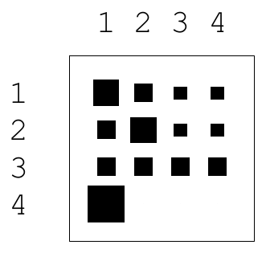

<!-- 源 PDF 物理页 152；原书印刷页 140 -->

图 8.1　联合信息、边缘熵、条件熵和互熵之间的关系。图内依次标有 $H(X,Y)$、$H(X)$、$H(Y)$、$H(X\mid Y)$、$I(X;Y)$ 和 $H(Y\mid X)$；原图注的“互熵”对应图中的互信息 $I(X;Y)$。

## 8.2　习题

**习题 8.1**〔难度 1〕设 $u,v,w$ 是三个相互独立的随机变量，其熵分别为 $H_u,H_v,H_w$。令 $X\equiv(U,V)$、$Y\equiv(V,W)$。求 $H(X,Y)$、$H(X\mid Y)$ 和 $I(X;Y)$。

**习题 8.2**〔难度 3；解答见原书印刷页 142〕参照条件熵的定义 (8.3)–(8.4)，举例确认：$H(X\mid y=b_k)$ 可能超过 $H(X)$，但对 $y$ 取平均后的 $H(X\mid Y)$ 小于 $H(X)$。所以数据是有帮助的：平均而言，它不会增加不确定性。

> **技术译注（非原书正文）**　原书题干说“小于”，但一般结论是 $H(X\mid Y)\leq H(X)$；当 $X$ 与 $Y$ 独立时取等号，不独立时才严格小于。原书第 8.4 节的解答证明的是这个一般结论。

**习题 8.3**〔难度 2；解答见原书印刷页 143〕证明熵的链式法则，即式 (8.7)：$H(X,Y)=H(X)+H(Y\mid X)$。

**习题 8.4**〔难度 2；解答见原书印刷页 143〕证明：由 $I(X;Y)\equiv H(X)-H(X\mid Y)$ 定义的互信息满足 $I(X;Y)=I(Y;X)$ 且 $I(X;Y)\geq0$。［提示：参见习题 2.26（原书印刷页 37），并注意

$$I(X;Y)=D_{\mathrm{KL}}\!\left(P(x,y)\parallel P(x)P(y)\right).\tag{8.11}$$

］

**习题 8.5**〔难度 4〕两个随机变量之间的“熵距离”可以定义为它们的联合熵与互信息之差：

$$D_H(X,Y)\equiv H(X,Y)-I(X;Y).\tag{8.12}$$

证明熵距离满足距离的公理：$D_H(X,Y)\geq0$、$D_H(X,X)=0$、$D_H(X,Y)=D_H(Y,X)$，以及 $D_H(X,Z)\leq D_H(X,Y)+D_H(Y,Z)$。［顺便说一句，我们以后大概不会再见到 $D_H(X,Y)$，但它很适合用来练习证明不等式。］

**习题 8.6**〔难度 2；解答见原书印刷页 147〕联合系综 $XY$ 具有如下联合分布：

| $P(x,y)$：$y\backslash x$ | $x=1$ | $x=2$ | $x=3$ | $x=4$ |
|:---:|---:|---:|---:|---:|
| $y=1$ | $1/8$ | $1/16$ | $1/32$ | $1/32$ |
| $y=2$ | $1/16$ | $1/8$ | $1/32$ | $1/32$ |
| $y=3$ | $1/16$ | $1/16$ | $1/16$ | $1/16$ |
| $y=4$ | $1/4$ | $0$ | $0$ | $0$ |

原书表旁的方块示意图：上方的 1–4 对应 $x$，左侧的 1–4 对应 $y$；黑方块的大小显示相应单元的概率，概率为零的单元留空。

求联合熵 $H(X,Y)$；边缘熵 $H(X)$ 与 $H(Y)$；对于 $y$ 的每一个取值，求条件熵 $H(X\mid y)$；再求条件熵 $H(X\mid Y)$、$H(Y\mid X)$，以及 $X$ 与 $Y$ 之间的互信息。
