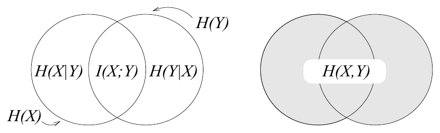

<!-- 源 PDF 物理页 153；原书印刷页 141 -->

**习题 8.7**〔难度 2；解答见原书印刷页 143〕考虑系综 $XYZ$，其中 $\mathcal A_X=\mathcal A_Y=\mathcal A_Z=\{0,1\}$；$x$ 与 $y$ 独立，且 $\mathcal P_X=\{p,1-p\}$、$\mathcal P_Y=\{q,1-q\}$，并令

$$z=(x+y)\bmod 2.\tag{8.13}$$

(a) 若 $q=1/2$，$\mathcal P_Z$ 是什么？$I(Z;X)$ 是多少？

(b) 对一般的 $p$ 和 $q$，$\mathcal P_Z$ 是什么？$I(Z;X)$ 是多少？注意，这个系综与二元对称信道有关：$x$ 是输入，$y$ 是噪声，$z$ 是输出。

图 8.2　熵的一种误导性表示（与图 8.1 对照）。图内分别标出 $H(X)$、$H(Y)$、$H(X\mid Y)$、$I(X;Y)$、$H(Y\mid X)$ 和 $H(X,Y)$。

### 三项熵

**习题 8.8**〔难度 3；解答见原书印刷页 143〕许多教材把图 8.1 画成维恩图的形式（图 8.2）。讨论为什么这样的图会误导人理解熵。提示：考虑三变量系综 $XYZ$：$x\in\{0,1\}$ 与 $y\in\{0,1\}$ 是独立的二元变量，而 $z\in\{0,1\}$ 定义为 $z=(x+y)\bmod2$。

## 8.3　进一步练习

### 数据处理定理

数据处理定理指出，处理数据只会破坏信息。

**习题 8.9**〔难度 3；解答见原书印刷页 144〕考虑一个系综 $WDR$，其中 $w$ 是世界的状态，$d$ 是收集到的数据，$r$ 是处理后的数据。这三个变量构成一条马尔可夫链：

$$w\longrightarrow d\longrightarrow r,\tag{8.14}$$

也就是说，概率 $P(w,d,r)$ 可以写成

$$P(w,d,r)=P(w)P(d\mid w)P(r\mid d).\tag{8.15}$$

证明 $R$ 平均向我们传达的关于 $W$ 的信息量 $I(W;R)$，小于或等于 $D$ 平均传达的关于 $W$ 的信息量 $I(W;D)$。

这个定理既提醒我们谨慎理解自己对“信息”的定义，也提醒我们谨慎看待数据处理！
