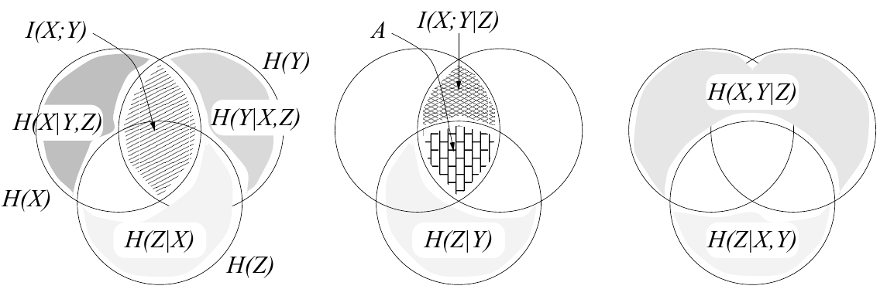

<!-- 源 PDF 物理页 156；原书印刷页 144 -->

图 8.3　熵的一种误导性表示，续图。图内标有 $H(X)$、$H(Y)$、$H(Z)$、$I(X;Y)$、$I(X;Y\mid Z)$、$H(X\mid Y,Z)$、$H(Y\mid X,Z)$、$H(Z\mid X)$、$H(Z\mid Y)$、$H(X,Y\mid Z)$、$H(Z\mid X,Y)$ 以及区域 $A$；交叉线与阴影保留原图。

例如，有些学生会以为，随机结果 $(x,y)$ 对应于图中的某个点，从而把熵与概率混淆。

第二，维恩图会使人以为，图中所有区域都对应正值。只有两个随机变量时，$H(X\mid Y)$、$I(X;Y)$ 和 $H(Y\mid X)$ 的确都是非负量。但一旦涉及三个变量，就会出现看似具有正面积、实际上却可能对应负值的区域。图 8.3 正确地表示了如下关系：

$$H(X)+H(Z\mid X)+H(Y\mid X,Z)=H(X,Y,Z).\tag{8.31}$$

然而，它会误导人以为条件互信息 $I(X;Y\mid Z)$ 小于互信息 $I(X;Y)$。实际上，标为 $A$ 的区域可能对应一个负值。考虑联合系综 $(X,Y,Z)$：$x\in\{0,1\}$ 与 $y\in\{0,1\}$ 是独立的二元变量，$z\in\{0,1\}$ 定义为 $z=(x+y)\bmod2$。显然 $H(X)=H(Y)=1$ 比特，$H(Z)=1$ 比特。又因为 $X$ 与 $Y$ 独立，所以 $H(Y\mid X)=H(Y)=1$，从而 $I(X;Y)=0$。但如果观察到 $z$，$X$ 与 $Y$ 就会相依：给定 $z$ 后，知道 $x$ 就知道 $y=(z-x)\bmod2$。因此 $I(X;Y\mid Z)=1$ 比特。若图要给出正确结果，区域 $A$ 就必须对应 $-1$ 比特。

> **技术译注（非原书正文）**　以上 $1$ 比特和 $-1$ 比特的具体数值还要求 $X,Y$ 各自均匀，即两个独立的公平比特；原书习题 8.8 只明说了“独立的二元变量”。

上述例子绝非刻意挑选的例外。若二元对称信道的输入是 $X$、噪声是 $Y$、输出是 $Z$，就有 $I(X;Y)=0$（输入与噪声独立），但 $I(X;Y\mid Z)>0$（一旦看到输出，未知的输入与未知的噪声就紧密相关！）。

因此，只有记住“看起来为正的面积可能代表负值”这一点，维恩图表示才是有效的。带着这一限定，用集合来理解熵也可能有帮助（Yeung，1991）。

**习题 8.9 的解答**（原书印刷页 141）。对任意联合系综 $XYZ$，互信息满足如下链式法则：

$$I(X;Y,Z)=I(X;Y)+I(X;Z\mid Y).\tag{8.32}$$

对于 $w\to d\to r$，给定 $d$ 时 $w$ 与 $r$ 独立，因此 $I(W;R\mid D)=0$。将链式法则用两次，得到

$$I(W;D,R)=I(W;D)\tag{8.33}$$

以及

$$I(W;D,R)=I(W;R)+I(W;D\mid R),\tag{8.34}$$

所以

$$I(W;R)-I(W;D)\leq0.\tag{8.35}$$
