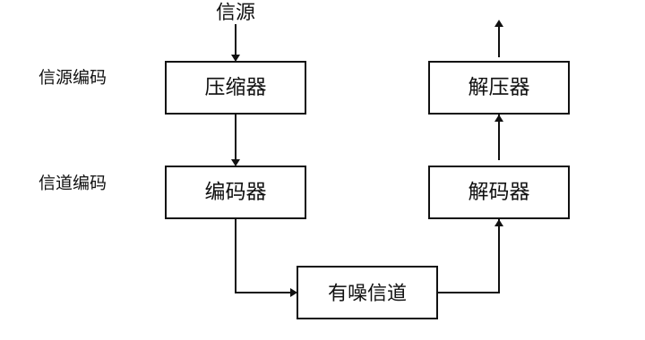

<!-- 源 PDF 物理页 158；原书印刷页 146 -->

# 第 9 章　有噪信道上的通信

> **编者导读（非原书正文）**　本章从具体信道的输入、输出概率出发，说明互信息如何衡量一次信道使用传达的信息，再以最大互信息定义信道容量。后半章给出 Shannon 有噪信道编码定理的表述和证明思路，并用二元信道、带噪打字机与图像识别等例子说明。

## 9.1　整体图景

原书无编号流程图：信源依次经过压缩器、编码器、有噪信道、解码器和解压器；压缩与解压属于信源编码，编码与解码属于信道编码。

第 4–6 章讨论了使用块码、符号码和流码进行的信源编码。我们当时默认，从压缩器到解压器的信道没有噪声。真实信道却存在噪声。接下来两章要讨论有噪信道编码：通过有噪信道实现无差错通信的根本可能性与局限。信道编码的目的，是让有噪信道表现得像无噪信道。我们假设待传输的数据已经过良好压缩，因此比特流没有显而易见的冗余。负责传输的信道码会重新加入一种特殊的冗余，使收到的带噪信号仍能解码。

假设我们每秒传输 1000 比特，$p_0=p_1=1/2$，信道以概率 $f=0.1$ 翻转每个比特。信息的传输速率是多少？我们可能把每秒预期的错误数减掉，猜测速率是每秒 900 比特。但这不对，因为接收者不知道错误发生在哪里。考虑噪声大到使接收符号与发送符号独立的情形。这对应 $f=0.5$，因为此时仅凭偶然就有一半接收符号是正确的。然而，当 $f=0.5$ 时，根本没有信息被传过去。

根据前面学到的熵，我们有理由用信源与接收信号之间的互信息来衡量传过去的信息量：它等于信源的熵减去已知接收信号时信源的条件熵。

现在先复习条件熵和互信息的定义，再考察能否借助这样的有噪信道可靠地通信。我们将说明：对任意信道 $Q$，存在一个非零速率，即容量 $C(Q)$；只要速率不超过它，就可以把差错概率降得任意小。
