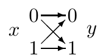
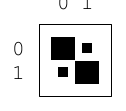
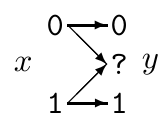
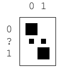
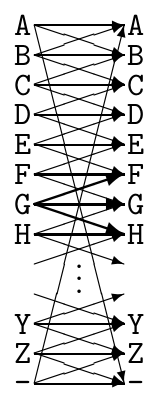
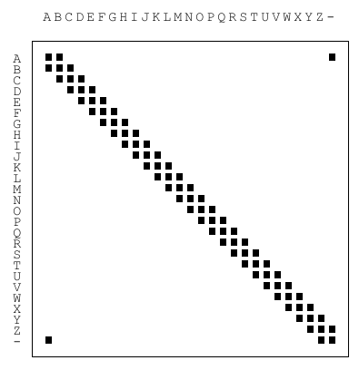
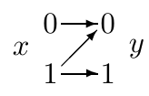
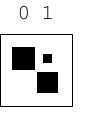

<!-- 源 PDF 物理页 160；原书印刷页 148 -->

下面是一些有用的信道模型。

**二元对称信道。** $\mathcal A_X=\{0,1\}$，$\mathcal A_Y=\{0,1\}$。

图内 $x$ 为输入、$y$ 为输出；矩阵的列对应 $x=0,1$，行对应 $y=0,1$，黑方块的大小表示转移概率。各转移概率为

$$\begin{array}{ll}
P(y=0\mid x=0)=1-f,&P(y=0\mid x=1)=f,\\
P(y=1\mid x=0)=f,&P(y=1\mid x=1)=1-f.
\end{array}$$

**二元擦除信道。** $\mathcal A_X=\{0,1\}$，$\mathcal A_Y=\{0,?,1\}$。

图内问号表示擦除；矩阵的列对应输入 $0,1$，行对应输出 $0,?,1$。各转移概率为

$$\begin{array}{ll}
P(y=0\mid x=0)=1-f,&P(y=0\mid x=1)=0,\\
P(y=?\mid x=0)=f,&P(y=?\mid x=1)=f,\\
P(y=1\mid x=0)=0,&P(y=1\mid x=1)=1-f.
\end{array}$$

**带噪打字机。** $\mathcal A_X=\mathcal A_Y$，均为 27 个字符 $\{\mathtt A,\mathtt B,\ldots,\mathtt Z,\mathtt{-}\}$。这些字符排成一个圆；打字者想输入 $\mathtt B$ 时，输出可能是 $\mathtt A$、$\mathtt B$ 或 $\mathtt C$，各以 $1/3$ 的概率出现。输入 $\mathtt C$ 时，输出为 $\mathtt B$、$\mathtt C$ 或 $\mathtt D$；依此类推，最后一个字符 $\mathtt{-}$ 与第一个字符 $\mathtt A$ 相邻。

图内左侧为输入字符、右侧为可能的输出字符；方块矩阵的列为输入、行为输出，对角线附近及首尾相接处的黑格表示非零概率。例如，

$$P(y=\mathtt F\mid x=\mathtt G)=P(y=\mathtt G\mid x=\mathtt G)=P(y=\mathtt H\mid x=\mathtt G)=\frac13.$$

**$Z$ 信道。** $\mathcal A_X=\{0,1\}$，$\mathcal A_Y=\{0,1\}$。

图中输入 $0$ 只会输出 $0$；输入 $1$ 可能输出 $0$ 或 $1$。矩阵的列对应输入，行对应输出。各转移概率为

$$\begin{array}{ll}
P(y=0\mid x=0)=1,&P(y=0\mid x=1)=f,\\
P(y=1\mid x=0)=0,&P(y=1\mid x=1)=1-f.
\end{array}$$

## 9.4　由输出推断输入

如果假设信道输入 $x$ 来自系综 $X$，就得到联合系综 $XY$，其中随机变量 $x,y$ 的联合分布为

$$P(x,y)=P(y\mid x)P(x).\tag{9.3}$$

收到某个特定符号 $y$ 后，输入符号 $x$ 是什么？通常不能确定。利用贝叶斯定理，可以写出输入的后验分布：

$$P(x\mid y)=\frac{P(y\mid x)P(x)}{P(y)}
=\frac{P(y\mid x)P(x)}{\sum_{x'}P(y\mid x')P(x')}.\tag{9.4}$$

**例 9.1。** 考虑差错概率 $f=0.15$ 的二元对称信道。输入系综为 $\mathcal P_X:\{p_0=0.9,p_1=0.1\}$。假设观察到 $y=1$。

$$\begin{aligned}
P(x=1\mid y=1)
&=\frac{P(y=1\mid x=1)P(x=1)}{\sum_{x'}P(y\mid x')P(x')}\\
&=\frac{0.85\times0.1}{0.85\times0.1+0.15\times0.9}\\
&=\frac{0.085}{0.22}=0.39.
\end{aligned}\tag{9.5}$$
