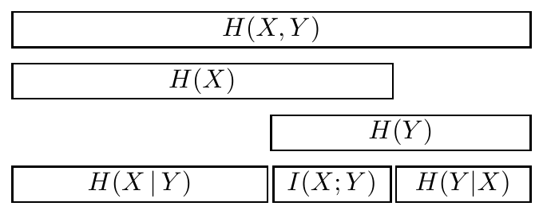

<!-- 源 PDF 物理页 161；原书印刷页 149 -->

因此，“$x=1$”仍比“$x=0$”的可能性小，不过不再像先前那样不可能。

**习题 9.2**〔难度 1；解答见原书印刷页 157〕现在假设观察到 $y=0$。计算给定 $y=0$ 时 $x=1$ 的概率。

**例 9.3。** 考虑差错概率 $f=0.15$ 的 $Z$ 信道。输入系综为 $\mathcal P_X:\{p_0=0.9,p_1=0.1\}$。假设观察到 $y=1$。

$$\begin{aligned}
P(x=1\mid y=1)
&=\frac{0.85\times0.1}{0.85\times0.1+0\times0.9}\\
&=\frac{0.085}{0.085}=1.0.
\end{aligned}\tag{9.6}$$

因此，给定输出 $y=1$，我们就能确定输入。

**习题 9.4**〔难度 1；解答见原书印刷页 157〕反过来，假设观察到 $y=0$。计算 $P(x=1\mid y=0)$。

## 9.5　信道传达的信息

现在考察一个信道能传达多少信息。从实际操作来看，我们想找到使用信道的方法，使传达的所有比特都能以可忽略的差错概率恢复。从数学角度看，给定一个输入系综 $X$，可用互信息衡量输出传达了多少关于输入的信息：

$$I(X;Y)\equiv H(X)-H(X\mid Y)=H(Y)-H(Y\mid X).\tag{9.7}$$

我们的目标是建立这两种观点之间的联系。先计算前述几个信道的 $I(X;Y)$。

### 计算互信息的提示

我们往往把 $I(X;Y)$ 看作 $H(X)-H(X\mid Y)$，即观察输出 $Y$ 后，输入 $X$ 的不确定性减少了多少。但实际计算时，改算 $H(Y)-H(Y\mid X)$ 常常更方便。

图 9.1　联合信息、边缘熵、条件熵和互熵之间的关系。这幅图很重要，所以原书再次给出。图内依次标有 $H(X,Y)$、$H(X)$、$H(Y)$、$H(X\mid Y)$、$I(X;Y)$ 和 $H(Y\mid X)$。

**例 9.5。** 再看二元对称信道：$f=0.15$，$\mathcal P_X:\{p_0=0.9,p_1=0.1\}$。前面已经隐含算出了输出的边缘概率：$P(y=0)=0.78$，$P(y=1)=0.22$。互信息为

$$I(X;Y)=H(Y)-H(Y\mid X).$$
