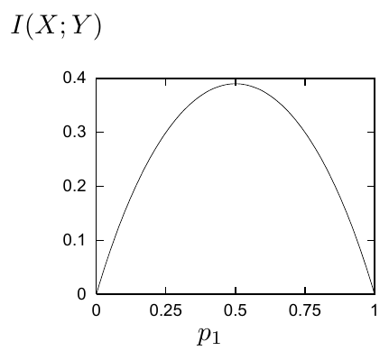
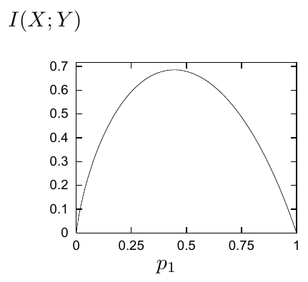

<!-- 源 PDF 物理页 163；原书印刷页 151 -->

还能做得多好？根据对称性，最优输入分布是 $\{0.5,0.5\}$，容量为

$$C(Q_{\mathrm{BSC}})=H_2(0.5)-H_2(0.15)=1.0-0.61=0.39\text{ 比特}.\tag{9.11}$$

后面会说明这一对称性论证。即使对它有所怀疑，我们也总能直接求互信息 $I(X;Y)$ 的最大值：

$$I(X;Y)=H_2\bigl((1-f)p_1+(1-p_1)f\bigr)-H_2(f)\qquad\text{（见图 9.2）。}\tag{9.12}$$

图 9.2　$f=0.15$ 的二元对称信道中，互信息 $I(X;Y)$ 随输入分布变化的曲线。横轴为 $p_1$，纵轴为 $I(X;Y)$；最大值在 $p_1=0.5$。

**例 9.10。** 带噪打字机的最优输入分布，是对输入字符 $x$ 的均匀分布；它给出 $C=\log_2 9$ 比特。

**例 9.11。** 考虑 $f=0.15$ 的 $Z$ 信道。确定最优输入分布没那么直接。对 $\mathcal P_X=\{p_0,p_1\}$，明确计算 $I(X;Y)$。首先要算 $P(y)$；其中 $y=1$ 的概率最容易写：

$$P(y=1)=p_1(1-f).\tag{9.13}$$

于是互信息为

$$\begin{aligned}
I(X;Y)&=H(Y)-H(Y\mid X)\\
&=H_2\bigl(p_1(1-f)\bigr)-\bigl(p_0H_2(0)+p_1H_2(f)\bigr)\\
&=H_2\bigl(p_1(1-f)\bigr)-p_1H_2(f).
\end{aligned}\tag{9.14}$$

这是 $p_1$ 的一个非平凡函数，见图 9.3。当 $f=0.15$ 时，它在 $p_1^*=0.445$ 处达到最大值，得到 $C(Q_Z)=0.685$。注意，最优输入分布不是 $\{0.5,0.5\}$。让输入符号 0 比 1 更常出现，可以多传输一点信息。

图 9.3　$f=0.15$ 的 $Z$ 信道中，互信息 $I(X;Y)$ 随输入分布变化的曲线。横轴为 $p_1$，纵轴为 $I(X;Y)$。

**习题 9.12**〔难度 1；解答见原书印刷页 158〕二元对称信道在一般 $f$ 下的容量是多少？

**习题 9.13**〔难度 2；解答见原书印刷页 158〕证明擦除概率 $f=0.15$ 的二元擦除信道容量为 $C_{\mathrm{BEC}}=0.85$。它在一般 $f$ 下的容量是多少？请作评论。

## 9.6　有噪信道编码定理

我们定义的“容量”看起来可能是信道传达信息量的一种度量。但尚不显然的一点是：容量确实给出了以任意小的差错概率，通过信道传送数据块的速率；这将在下一章证明。

先作如下定义。

**信道 $Q$ 的一个 $(N,K)$ 块码**，是一列 $S=2^K$ 个码字：

$$\{\mathbf x^{(1)},\mathbf x^{(2)},\ldots,\mathbf x^{(2^K)}\},\qquad
\mathbf x^{(s)}\in\mathcal A_X^N.$$

每个码字的长度都是 $N$。利用该码，可以把信号 $s\in\{1,2,3,\ldots,2^K\}$ 编码为 $\mathbf x^{(s)}$。［码字数 $S$ 是整数，但选择一个码字所指定的比特数 $K\equiv\log_2 S$ 不一定是整数。］
