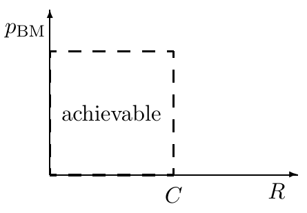

<!-- 源 PDF 物理页 164；原书印刷页 152 -->

码的**速率**为 $R=K/N$，单位是每次信道使用的比特数。

［我们会对所有信道使用这一定义，而不只限于二元输入信道。但请注意，对有 $q$ 个输入符号的信道，有时也约定把码率定义为 $K/(N\log q)$。］

**$(N,K)$ 块码的解码器**，是一个映射：把长度为 $N$ 的信道输出串 $\mathcal A_Y^N$ 映射为码字标签 $\hat s\in\{0,1,2,\ldots,2^K\}$。额外的符号 $\hat s=0$ 可用来表示“解码失败”。

给定信道、码和解码器，以及被编码信号的概率分布 $P(s_{\mathrm{in}})$，**块差错概率**为

$$p_{\mathrm B}=\sum_{s_{\mathrm{in}}}P(s_{\mathrm{in}})\,
P(s_{\mathrm{out}}\ne s_{\mathrm{in}}\mid s_{\mathrm{in}}).\tag{9.15}$$

**最大块差错概率**为

$$p_{\mathrm{BM}}=\max_{s_{\mathrm{in}}}
P(s_{\mathrm{out}}\ne s_{\mathrm{in}}\mid s_{\mathrm{in}}).\tag{9.16}$$

**信道码的最优解码器**，是使块差错概率最小的解码器。它把输出 $\mathbf y$ 解码为后验概率 $P(s\mid\mathbf y)$ 最大的输入 $s$：

$$P(s\mid\mathbf y)=
\frac{P(\mathbf y\mid s)P(s)}
{\sum_{s'}P(\mathbf y\mid s')P(s')}.\tag{9.17}$$

$$\hat s_{\mathrm{optimal}}=\arg\max_s P(s\mid\mathbf y).\tag{9.18}$$

通常假设 $s$ 的先验分布均匀；这时最优解码器也是**最大似然解码器**，即把输出 $\mathbf y$ 映射到使似然 $P(\mathbf y\mid s)$ 最大的输入 $s$。

**比特差错概率 $p_{\mathrm b}$** 的定义假定码字编号 $s$ 用长为 $K$ 比特的二进制向量 $\mathbf s$ 表示。它是输出编号 $\mathbf s_{\mathrm{out}}$ 的某一位不同于输入编号 $\mathbf s_{\mathrm{in}}$ 对应位的平均概率，对全部 $K$ 位取平均。

**Shannon 有噪信道编码定理（第一部分）。** 每个离散无记忆信道都对应一个非负数 $C$，称为信道容量，并具有以下性质：对任何 $\epsilon>0$ 和 $R<C$，只要 $N$ 足够大，就存在一个长度为 $N$、速率不小于 $R$ 的块码及一个解码算法，使最大块差错概率小于 $\epsilon$。

图 9.4　Shannon 有噪信道编码定理第一部分断言可达到的 $(R,p_{\mathrm{BM}})$ 平面区域。图内 *achievable* 意为“可达到”；横轴 $R$ 为速率，纵轴 $p_{\mathrm{BM}}$ 为最大块差错概率，虚线标出容量 $C$。

### 用带噪打字机信道验证该定理

带噪打字机的情形很容易验证定理，因为使用块长 $N=1$ 的码就能构造完全无差错的通信策略：只选用 $\mathtt B,\mathtt E,\mathtt H,\ldots,\mathtt Z$，即每隔三个字母取一个。这些字母构成输入字母表的一个**互不混淆子集**（见图 9.5）。任意输出都能唯一解码。该子集有 9 个输入，因此系统的无差错信息速率为 $\log_2 9$ 比特，恰等于例 9.10（原书印刷页 151）算出的容量 $C$。
