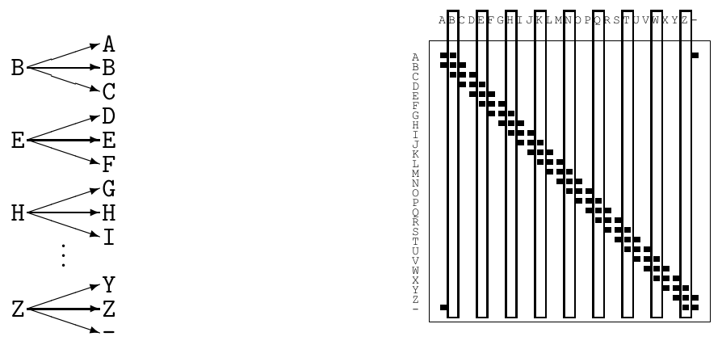
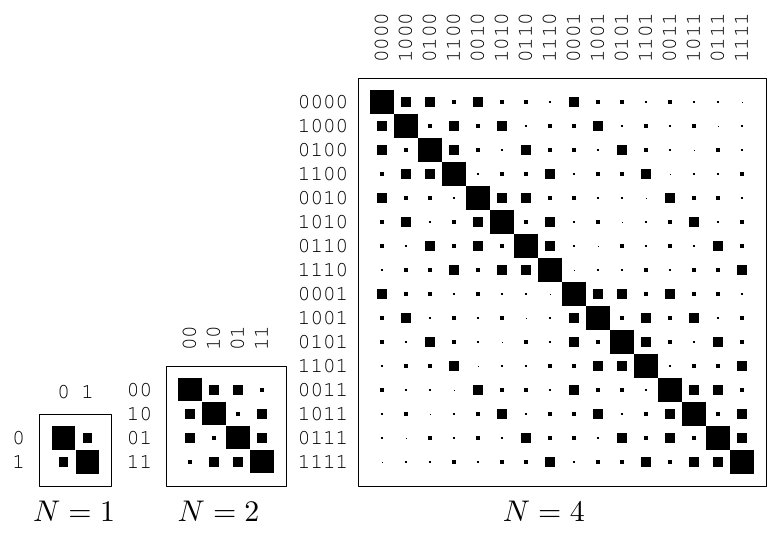

<!-- 源 PDF 物理页 165；原书印刷页 153 -->

图 9.5　带噪打字机输入中互不混淆的子集。图内左侧每隔三个字母选一个输入；右侧矩阵的竖框标出所选输入列，各列可能产生的输出互不重叠。

图 9.6　由转移概率为 $0.15$ 的二元对称信道得到的扩展信道。图内 $N=1,2,4$ 分别表示一次、两次、四次信道使用；各列为输入串，各行为输出串，黑方块大小表示转移概率。

该如何把带噪打字机的例子对应到定理中的各项？下表给出说明。

| 定理的表述 | 对带噪打字机的应用 |
|:---|:---|
| 每个离散无记忆信道都有一个对应的非负数 $C$。 | 容量 $C=\log_2 9$。 |
| 对任何 $\epsilon>0$ 和 $R<C$，只要 $N$ 足够大， | 不论 $\epsilon$ 与 $R$ 取何值，我们都令块长 $N=1$。 |
| 存在一个长为 $N$、速率 $\geq R$ 的块码， | 块码是 $\{\mathtt B,\mathtt E,\ldots,\mathtt Z\}$。由 $2^K=9$ 得 $K=\log_2 9$，所以码率为 $\log_2 9$，高于所要求的 $R$。 |
| 以及一个解码算法， | 解码算法把接收到的字母映射到码中最近的字母； |
| 使最大块差错概率 $<\epsilon$。 | 最大块差错概率为零，小于给定的 $\epsilon$。 |

## 9.7　证明的直观预览

### 扩展信道

为证明定理适用于任意给定信道，我们考察将信道使用 $N$ 次得到的**扩展信道**。扩展信道有 $|\mathcal A_X|^N$ 种可能的输入串 $\mathbf x$，以及 $|\mathcal A_Y|^N$ 种可能的输出串。由二元对称信道和 $Z$ 信道得到的扩展信道分别见图 9.6 和图 9.7，其中展示了 $N=2$ 和 $N=4$ 的情形。
