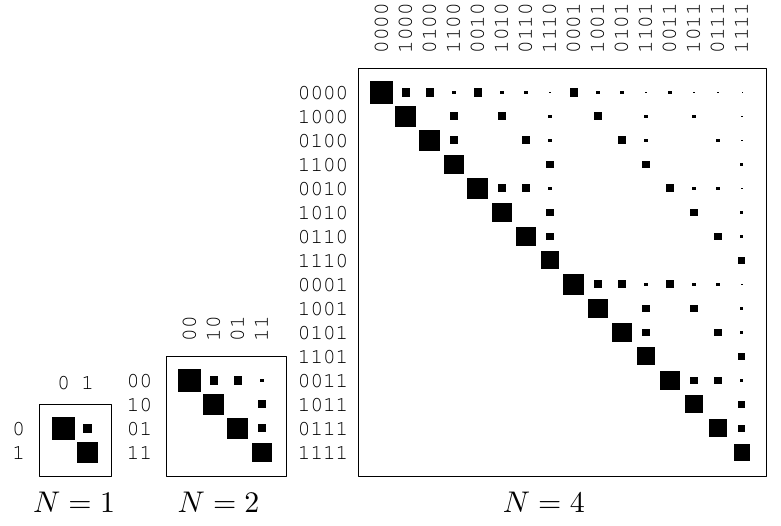
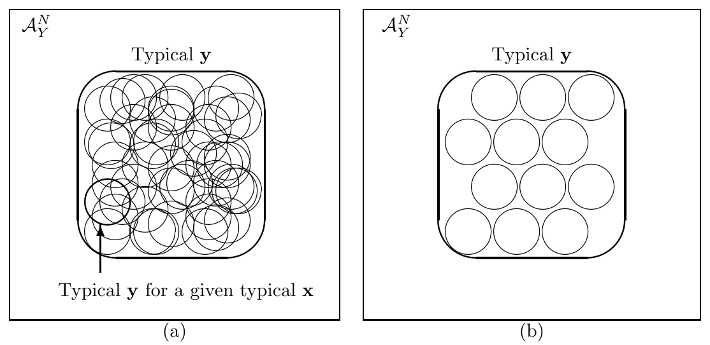

<!-- 源 PDF 物理页 166；原书印刷页 154 -->

图 9.7　由转移概率为 $0.15$ 的 $Z$ 信道得到的扩展信道。图内 $N=1,2,4$ 表示信道使用次数；每列对应一种输入，每行对应一种不同的输出；黑方块大小表示转移概率。

图 9.8　(a) 与典型输入 $\mathbf x$ 对应的 $\mathcal A_Y^N$ 中若干典型输出集；(b) 从 (a) 中选取互不重叠的典型输出集。可将这幅图与图 9.5 中带噪打字机的解决办法对照。图内 *Typical y* 意为“典型输出 $\mathbf y$”，*Typical y for a given typical x* 意为“给定一个典型输入 $\mathbf x$ 时的典型输出 $\mathbf y$”；外框为输出空间 $\mathcal A_Y^N$。

**习题 9.14**〔难度 2；解答见原书印刷页 159〕求擦除概率为 $0.15$ 的二元擦除信道扩展为 $N=2$ 时的转移概率矩阵 $Q$。

从该转移矩阵中选取两列，可以为这个信道定义一个块长 $N=2$、码率 $1/2$ 的码。哪两列是最好的选择？解码算法是什么？

证明有噪信道编码定理时，要用到很大的块长 $N$。直观想法是：当 $N$ 很大时，扩展信道看起来很像带噪打字机。任意一个给定输入 $\mathbf x$，都很可能产生落在输出字母表一个小子空间中的输出；这个小子空间就是给定该输入时的**典型输出集**。因此，可以找到一个互不混淆的输入子集，其产生的输出序列基本不相交。给定 $N$ 后，考虑一种生成这种输入子集的方法，并数出它包含多少种不同的输入。

设想从系综 $X^N$ 抽取扩展信道的输入序列 $\mathbf x$，其中 $X$ 是输入字母表上的任意系综。回想第 4 章的信源编码定理，并考虑高概率输出序列 $\mathbf y$ 的数目。典型输出序列 $\mathbf y$ 总共有 $2^{NH(Y)}$ 个，概率彼此相近。对任意一个给定的典型输入序列 $\mathbf x$，大约有 $2^{NH(Y\mid X)}$ 个高概率输出序列。图 9.8(a) 用圆圈表示了 $\mathcal A_Y^N$ 中的若干这样的子集。

现在设想只使用典型输入 $\mathbf x$ 的一个子集，使与之对应的典型输出集互不重叠，如图 9.8(b)。这样，就可以用整个典型 $\mathbf y$ 集的大小 $2^{NH(Y)}$ 除以每个“给定典型 $\mathbf x$ 时的典型 $\mathbf y$ 集”的大小 $2^{NH(Y\mid X)}$，从而给出互不混淆输入数目的界。
