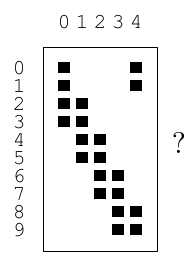

<!-- 源 PDF 物理页 167；原书印刷页 155 -->

若这些输入从典型输入集合 $\mathbf x\sim X^N$ 中选取，那么互不混淆输入的数目不超过
$2^{NH(Y)-NH(Y\mid X)}=2^{NI(X;Y)}$。

当 $X$ 是使 $I(X;Y)$ 最大的系综时，这个界达到最大，此时互不混淆输入的数目不超过 $2^{NC}$。因此，当差错概率趋于零时，渐近地每次信道使用至多可以传达 $C$ 比特，不能更多。□

以上概述还没有严格证明可靠通信确实可行；这是下一章的任务。

## 9.8　进一步练习

**习题 9.15**〔难度 3；解答见原书印刷页 159〕回顾 $f=0.15$ 的 $Z$ 信道容量计算。

(a) 为什么 $p_1^*<0.5$？可以说应该多使用输入 0，因为它传输时不会出错；也可以说应该多使用输入 1，因为它常会产生很有价值的输出 1，使人能够确定输入！试着给出有说服力的论证。

(b) 对一般的 $f$，证明最优输入分布满足

$$p_1^*=\frac{1/(1-f)}{1+2^{H_2(f)/(1-f)}}.\tag{9.19}$$

(c) 如果噪声水平 $f$ 非常接近 1，$p_1^*$ 会怎样？

**习题 9.16**〔难度 2；解答见原书印刷页 159〕以 $f$ 为横轴，分别画出 $Z$ 信道、二元对称信道和二元擦除信道的容量曲线草图。

**习题 9.17**〔难度 2〕下面这个有五种输入、十种输出的信道，其转移概率矩阵所对应的容量是多少？

$$Q=\begin{bmatrix}
0.25&0&0&0&0.25\\
0.25&0&0&0&0.25\\
0.25&0.25&0&0&0\\
0.25&0.25&0&0&0\\
0&0.25&0.25&0&0\\
0&0.25&0.25&0&0\\
0&0&0.25&0.25&0\\
0&0&0.25&0.25&0\\
0&0&0&0.25&0.25\\
0&0&0&0.25&0.25
\end{bmatrix}\tag{9.20}$$

原书矩阵旁的方块图：上方 0–4 为输入列，左侧 0–9 为输出行；黑方块标示非零转移概率。

**习题 9.18**〔难度 2；解答见原书印刷页 159〕考虑二元输入 $x\in\{-1,+1\}$、实数输出字母表 $\mathcal A_Y$ 的高斯信道，其转移概率密度为

$$Q(y\mid x,\alpha,\sigma)=\frac{1}{\sqrt{2\pi\sigma^2}}
e^{-(y-x\alpha)^2/(2\sigma^2)},\tag{9.21}$$

其中 $\alpha$ 是信号幅度。

(a) 假设两种输入等可能，计算给定 $y$ 时 $x$ 的后验概率，并把答案写成

$$P(x=1\mid y,\alpha,\sigma)=\frac{1}{1+e^{-a(y)}}.\tag{9.22}$$
