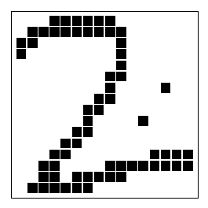
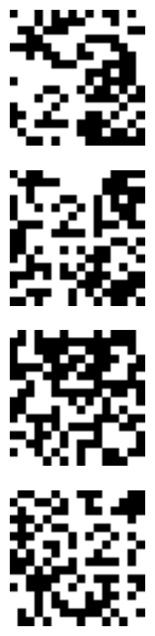

<!-- 源 PDF 物理页 168；原书印刷页 156 -->

画出 $P(x=1\mid y,\alpha,\sigma)$ 随 $y$ 变化的曲线草图。

(b) 假设只需传输一个比特。最优解码器是什么？它的差错概率是多少？请用信噪比 $\alpha^2/\sigma^2$ 和误差函数（高斯分布的累积概率函数）表示答案：

$$\Phi(z)\equiv\int_{-\infty}^{z}\frac{1}{\sqrt{2\pi}}e^{-z^2/2}\,\mathrm dz.\tag{9.23}$$

［请注意，这里对误差函数 $\Phi(z)$ 的定义可能与其他人的定义不同。］

### 将模式识别视为有噪信道

许多模式识别问题都可以用通信信道来理解。以识别手写数字为例（如信封上的邮政编码）。书写数字的人想从集合 $\mathcal A_X=\{0,1,2,3,\ldots,9\}$ 中传达一条消息；所选的数字就是信道输入。信道输出是纸上的墨迹图案。如果用 256 个二元像素表示墨迹，信道 $Q$ 的输出就是随机变量 $y\in\mathcal A_Y=\{0,1\}^{256}$。页边展示了该字母表中的一个元素。

**习题 9.19**〔难度 2〕估计 $\mathcal A_Y$ 中有多少图案能被认作字符“2”。［本题的目的，是尽可能展示出大量可识别为数字 2 的图案确实存在。］

讨论如何为信道 $P(y\mid x=2)$ 建模。估计概率分布 $P(y\mid x=2)$ 的熵。

模式识别的一种策略，是对每个输入值 $x\in\{0,1,2,3,\ldots,9\}$ 建立一个 $P(y\mid x)$ 模型，再利用贝叶斯定理由 $y$ 推断 $x$：

$$P(x\mid y)=\frac{P(y\mid x)P(x)}
{\sum_{x'}P(y\mid x')P(x')}.\tag{9.24}$$

这种策略称为**完整概率建模**或**生成式建模**（generative modelling）。本书写作时的语音识别系统基本也是这样工作的。除了信道模型 $P(y\mid x)$，还要使用先验概率分布 $P(x)$；在字符识别和语音识别中，它是一个语言模型，根据上下文以及已知的语言语法和统计规律，给出下一个字符或词的概率。

图 9.9　另外几个“2”。

### 随机编码

**习题 9.20**〔难度 2；解答见原书印刷页 160〕一个房间里有 24 人，至少两人生日相同（即出生的月和日相同）的概率是多少？生日相同的人对数的期望是多少？这两个问题哪一个更容易求解？哪一个答案更能帮助理解问题？求解本题及后续题目时，可用 $A=$ 一年中的天数 $=365$，$S=$ 人数 $=24$ 等记号。

**习题 9.21**〔难度 2〕生日问题也可以联系到一种编码方案。假设我们想向房间外的人传达一条消息，指明房间里的 24 人中选中了哪一人。
