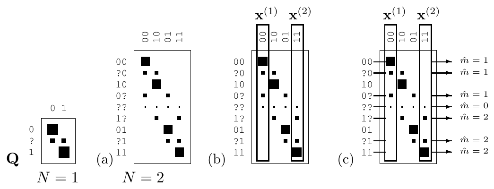
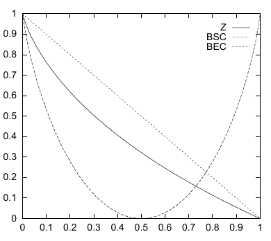

<!-- 源 PDF 物理页 171；原书印刷页 159 -->

图 9.10　(a) 由擦除概率为 $0.15$ 的二元擦除信道得到的扩展信道（$N=2$）；(b) 由码字 $\mathtt{00}$ 与 $\mathtt{11}$ 组成的块码；(c) 该码的最优解码器。图内 $Q$ 是转移矩阵，$\mathbf x^{(1)},\mathbf x^{(2)}$ 为两个码字；输出旁的 $\hat m=1,2,0$ 分别表示译为第一、第二码字或放弃解码。

**习题 9.14 的解答**（原书印刷页 153）。扩展信道见图 9.10。对 $N=2$ 的信道，最好的码可从转移矩阵中选取重叠最少的两列，例如 $\mathtt{00}$ 和 $\mathtt{11}$。如果扩展信道输出属于最上面的四种，解码算法返回 $\mathtt{00}$；如果属于最下面的四种，返回 $\mathtt{11}$；如果输出为 $\mathtt{??}$，则放弃解码。

**习题 9.15 的解答**（原书印刷页 155）。例 9.11（原书印刷页 151）给出了 $Z$ 信道输入与输出间的互信息：

$$\begin{aligned}
I(X;Y)&=H(Y)-H(Y\mid X)\\
&=H_2\bigl(p_1(1-f)\bigr)-p_1H_2(f).
\end{aligned}\tag{9.47}$$

对 $p_1$ 求导，注意不要混淆 $\log_2$ 与 $\log_e$：

$$\frac{\mathrm d}{\mathrm dp_1}I(X;Y)
=(1-f)\log_2\frac{1-p_1(1-f)}{p_1(1-f)}-H_2(f).\tag{9.48}$$

令导数为零，再利用习题 2.17（原书印刷页 36）中练过的变形技巧，得到

$$p_1^*(1-f)=\frac{1}{1+2^{H_2(f)/(1-f)}},\tag{9.49}$$

因此最优输入分布为

$$p_1^*=\frac{1/(1-f)}{1+2^{H_2(f)/(1-f)}}.\tag{9.50}$$

当噪声水平 $f$ 趋近于 1 时，这个表达式趋于 $1/e$（可以用洛必达法则证明）。

对所有 $f$，$p_1^*<1/2$。粗略地说，输入 1 比输入 0 用得少，是因为输入 1 时有噪信道向接收串注入了熵；输入 0 时，噪声的熵为零。

> **技术译注（非原书正文）**　原文的“对所有 $f$”若包含端点，就需要限定：$f=0$ 时式 (9.50) 给出 $p_1^*=1/2$；$f=1$ 时信道容量为零，最优输入分布不唯一。因此严格不等式 $p_1^*<1/2$ 适用于 $0<f<1$。

图 9.11　$Z$ 信道、二元对称信道（BSC）和二元擦除信道（BEC）的容量。横轴为差错或擦除概率 $f$，纵轴为容量；图内曲线标识 *Z*、*BSC*、*BEC* 分别表示这三种信道。

**习题 9.16 的解答**（原书印刷页 155）。三种信道的容量见图 9.11。当 $f<0.5$ 时，BEC 的容量最高，BSC 的容量最低。

**习题 9.18 的解答**（原书印刷页 155）。给定 $y$，后验概率比的对数为

$$a(y)=\ln\frac{P(x=1\mid y,\alpha,\sigma)}
{P(x=-1\mid y,\alpha,\sigma)}
=\ln\frac{Q(y\mid x=1,\alpha,\sigma)}
{Q(y\mid x=-1,\alpha,\sigma)}
=\frac{2\alpha y}{\sigma^2}.\tag{9.51}$$
