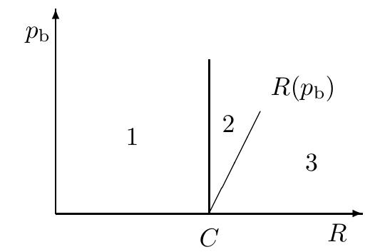

<!-- 源 PDF 物理页 174；原书印刷页 162 -->

# 第 10 章　有噪信道编码定理

> **编者导读（非原书正文）**　本章先用联合典型序列证明：只要传输速率低于信道容量，充分长的码就能把差错概率压到任意小。随后讨论允许一定比特差错时的速率边界、如何计算容量，以及编码定理与实际设计纠错码之间的距离。

## 10.1　定理

定理分成三部分：两个肯定性结论和一个否定性结论。第一个是主要的肯定性结论。

1. 对每个离散无记忆信道，信道容量

   $$C=\max_{P_X}I(X;Y)\tag{10.1}$$

   具有以下性质：对任意 $\epsilon>0$ 和 $R<C$，只要 $N$ 足够大，就存在一个长为 $N$、速率不小于 $R$ 的码，以及一种解码算法，使最大块差错概率小于 $\epsilon$。

2. 如果比特差错概率 $p_{\mathrm b}$ 可以接受，则直到 $R(p_{\mathrm b})$ 的速率都可达到，其中

   $$R(p_{\mathrm b})=\frac{C}{1-H_2(p_{\mathrm b})}.\tag{10.2}$$

3. 对任意 $p_{\mathrm b}$，大于 $R(p_{\mathrm b})$ 的速率不可达到。

图 10.1　$(R,p_{\mathrm b})$ 平面中本章要证明可达到的区域（1、2）和不可达到的区域（3）。图内横轴为速率 $R$，纵轴为比特差错概率 $p_{\mathrm b}$；竖线位于容量 $C$，曲线标为 $R(p_{\mathrm b})$。

## 10.2　联合典型序列

下面把上一章给出的直观预览形式化。

我们将把码字 $\mathbf x^{(s)}$ 定义为来自系综 $X^N$，并考虑随机选取一个码字及其相应的信道输出 $\mathbf y$，由此定义联合系综 $(XY)^N$。我们将使用**典型集解码器**：如果 $\mathbf x^{(s)}$ 与 $\mathbf y$ 是**联合典型**的，就把接收到的信号 $\mathbf y$ 解码为 $s$。联合典型的含义稍后定义。

证明的关键是确定两个概率：（a）真实输入码字与输出序列不是联合典型的概率；（b）某个错误的输入码字与输出序列是联合典型的概率。我们将证明，只要码字数少于 $2^{NC}$，且系综 $X$ 取最优输入分布，那么当 $N$ 很大时，这两个概率都趋于零。

**联合典型性。** 对于概率分布 $P(x,y)$，一对长度为 $N$ 的序列 $\mathbf x,\mathbf y$ 称为**联合典型**（容差为 $\beta$），当且仅当以下三个条件都成立：

$$\mathbf x\text{ 对 }P(x)\text{ 典型，即 }\left|\frac1N\log\frac1{P(\mathbf x)}-H(X)\right|<\beta,$$

$$\mathbf y\text{ 对 }P(y)\text{ 典型，即 }\left|\frac1N\log\frac1{P(\mathbf y)}-H(Y)\right|<\beta,$$

$$\mathbf x,\mathbf y\text{ 对 }P(x,y)\text{ 典型，即 }\left|\frac1N\log\frac1{P(\mathbf x,\mathbf y)}-H(X,Y)\right|<\beta.$$
