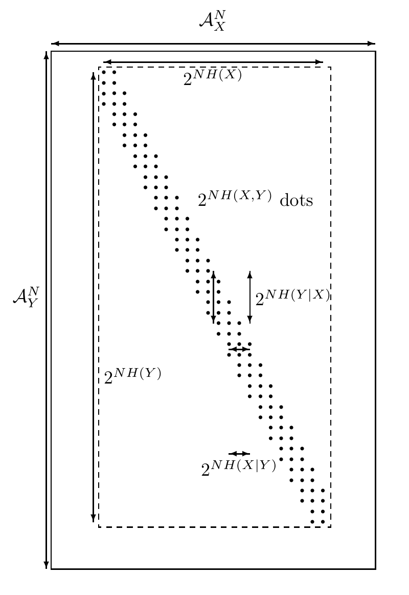

<!-- 源 PDF 物理页 176；原书印刷页 164 -->

图 10.2　联合典型集。水平方向代表 $\mathcal A_X^N$，即全部长度为 $N$ 的输入串；竖直方向代表 $\mathcal A_Y^N$，即全部长度为 $N$ 的输出串。外框包含所有可能的输入输出序列对。每个点表示一对联合典型序列 $(\mathbf x,\mathbf y)$；这类序列对的总数约为 $2^{NH(X,Y)}$。图内虚线矩形的宽、高分别标为 $2^{NH(X)}$、$2^{NH(Y)}$，点带的水平、竖直尺度分别标为 $2^{NH(X\mid Y)}$、$2^{NH(Y\mid X)}$。

## 10.3　有噪信道编码定理的证明

### 类比

设想我们要证明：一百个婴儿组成的一组中，至少有一个体重低于 10 千克。逐个抓住婴儿称重很困难。Shannon 的办法是把他们全都抱到一台大秤上，一起称重。如果发现平均体重低于 10 千克，就一定至少有一个婴儿体重低于 10 千克——事实上必定有许多个！不过，Shannon 的办法未必总能揭示体重不足的孩子：只要这一组里混入极少数大象，平均值就可能被抬高。但如果用这个办法测出总重量低于 1000 千克，任务就完成了。

图 10.3　Shannon 用来证明至少有一个婴儿体重低于 10 千克的方法。

### 从瘦小的孩子到出色的码

我们要证明，存在一种码和一个解码器，其差错概率很小。评价任何特定编码—解码系统的差错概率并不容易。Shannon 的创新在于：他并不先构造一种好码和解码系统再评价差错概率，而是计算**所有码的平均块差错概率**，并证明这一平均值很小。于是，其中必定存在块差错概率很小的个别码。

### 随机编码与典型集解码

考虑下面这种编码—解码系统，其速率为 $R'$。

1. 固定 $P(x)$，按照下面的分布，随机生成一个 $(N,NR')=(N,K)$ 码 $\mathcal C$ 的 $S=2^{NR'}$ 个码字：
