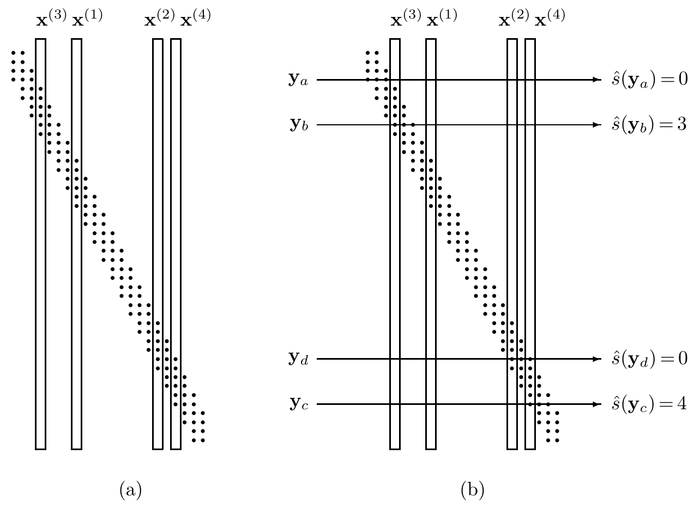

<!-- 源 PDF 物理页 177；原书印刷页 165 -->

   $$P(\mathbf x)=\prod_{n=1}^{N}P(x_n).\tag{10.11}$$

   图 10.4a 示意了一个随机码。

图 10.4　（a）一个随机码。（b）典型集解码器的解码例子。若序列与任何码字都不联合典型，例如 $\mathbf y_a$，便解码为 $\hat s=0$；若序列只与一个码字联合典型，例如 $\mathbf y_b$ 只与 $\mathbf x^{(3)}$ 联合典型，便解码为 $\hat s=3$。同理，$\mathbf y_c$ 解码为 $\hat s=4$。若序列与多个码字联合典型，例如 $\mathbf y_d$，也解码为 $\hat s=0$。图内四列码字标为 $\mathbf x^{(3)},\mathbf x^{(1)},\mathbf x^{(2)},\mathbf x^{(4)}$；（b）中的四条横线分别是 $\mathbf y_a,\mathbf y_b,\mathbf y_d,\mathbf y_c$。

2. 发送者和接收者都知道这个码。

3. 从 $\{1,2,\ldots,2^{NR'}\}$ 中选出消息 $s$，发送 $\mathbf x^{(s)}$。接收信号为 $\mathbf y$，且

   $$P(\mathbf y\mid\mathbf x^{(s)})=\prod_{n=1}^{N}P(y_n\mid x_n^{(s)}).\tag{10.12}$$

4. 对信号进行典型集解码。

   **典型集解码。** 如果 $(\mathbf x^{(\hat s)},\mathbf y)$ 联合典型，而且没有其他 $s'$ 使 $(\mathbf x^{(s')},\mathbf y)$ 联合典型，就把 $\mathbf y$ 解码为 $\hat s$；否则宣布解码失败（$\hat s=0$）。

   这并非最优解码算法，但已足够好，而且更容易分析。图 10.4b 展示了典型集解码器。

5. 若 $\hat s\ne s$，便发生解码差错。

这里需要区分三种差错概率。第一种是特定码 $\mathcal C$ 的块差错概率，即

$$p_{\mathrm B}(\mathcal C)\equiv P(\hat s\ne s\mid\mathcal C).\tag{10.13}$$

对任意给定的码，这个量都很难计算。

第二种是所有码的块差错概率的平均值：

$$\langle p_{\mathrm B}\rangle\equiv\sum_{\mathcal C}P(\hat s\ne s\mid\mathcal C)P(\mathcal C).\tag{10.14}$$
