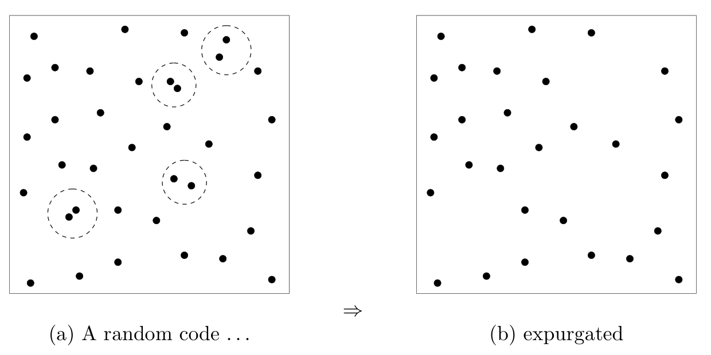
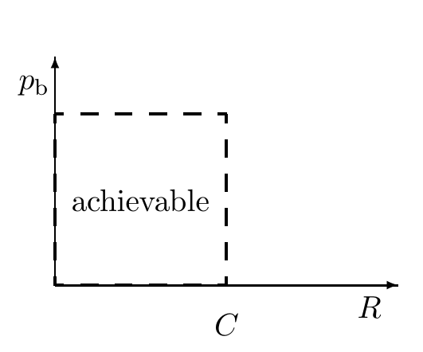

<!-- 源 PDF 物理页 179；原书印刷页 167 -->

图 10.5　剔除法如何工作。（a）典型随机码中，有一小部分码字发生“碰撞”：成对码字靠得足够近，发送其中任意一个时的差错概率便不小。把这些容易相互混淆的码字都删掉，就得到一个新码。（b）新码的码字略少，速率略低，但最大差错概率大幅减小。图内（a）标为“一个随机码……”，（b）标为“剔除后”；虚线圈出了相近的码字对。

2. 由于对所有码取平均的差错概率小于 $2\delta$，一定存在一个码，其平均块差错概率 $p_{\mathrm B}(\mathcal C)<2\delta$。

3. 为说明不仅平均差错概率，而且最大差错概率 $p_{\mathrm{BM}}$ 也能很小，我们丢掉该码中表现最差的一半码字，也就是最可能引起差错的码字。剩余码字各自的条件差错概率必定小于 $4\delta$。用它们定义一个新码。新码有 $2^{NR'-1}$ 个码字；换言之，速率从 $R'$ 降到了 $R'-1/N$（当 $N$ 很大时，这点降低可以忽略），并且达到 $p_{\mathrm{BM}}<4\delta$。这一技巧称为**剔除法**（expurgation，见图 10.5）。得到的码未必是同速率、同长度中最好的码，但足以证明本章要证的有噪信道编码定理。

总之，我们能够“构造”速率为 $R'-1/N$ 的码，其中 $R'<C-3\beta$，且最大差错概率小于 $4\delta$。令 $R'=(R+C)/2$、$\delta=\epsilon/4$、$\beta<(C-R')/3$，并取足够大的 $N$ 使其余条件成立，就得到定理所述的结论。定理的第 1 部分得证。$\square$

图 10.6　定理第 1 部分证明的 $(R,p_{\mathrm b})$ 平面可达区域。图内横轴为 $R$、纵轴为 $p_{\mathrm b}$，虚线位于容量 $C$，*achievable* 表示“可达到”。［我们已经证明，最大块差错概率 $p_{\mathrm{BM}}$ 可任意小；因此比它更小的比特差错概率 $p_{\mathrm b}$ 也可任意小。］

## 10.4　在超过容量的速率下通信（允许差错）

我们已经证明，对任何离散无记忆信道，图 10.6 所示 $(R,p_{\mathrm b})$ 平面中的一部分区域是可达到的。我们已经说明：任何有噪信道都可以转变为一个基本无噪、速率最高为每次使用信道 $C$ 比特的二元信道。下面把非零差错概率下可达区域的右边界向右扩展。［这称为**率失真理论**。］

这里要用一个新技巧。既然已知我们可以把有噪信道转变成速率较低的理想信道，那么只需考虑在无噪信道上允许差错的通信：若允许出错，通过无噪信道能通信得多快？

考虑一个无噪二元信道，假设我们迫使通信速率超过它的 1 比特容量。例如，若要求发送者以每次使用信道 $R=2$ 比特的速率通信，他实际上必须丢掉一半信息。若目标是使比特差错概率尽可能小，最好怎样做？一个简单策略是只传送信源比特中的 $1/R$，其余全部忽略。接收者随机猜测缺失的 $1-1/R$ 部分，而
