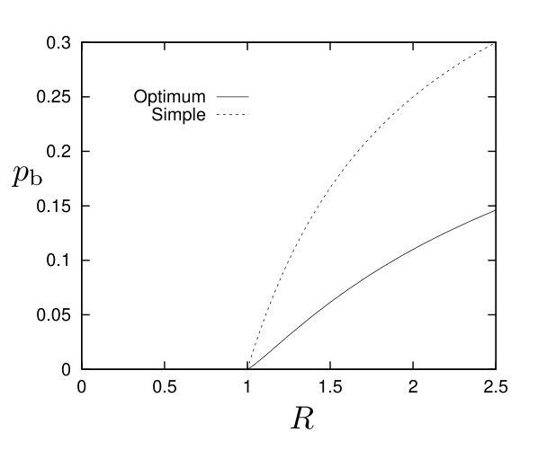

<!-- 源 PDF 物理页 180；原书印刷页 168 -->

平均比特差错概率为

$$p_{\mathrm b}=\frac12(1-1/R).\tag{10.19}$$

这一策略对应的曲线是图 10.7 中的虚线。

若把出错的风险均匀分摊到所有比特上，在降低 $p_{\mathrm b}$ 方面可以做得更好。事实上，我们可以达到 $p_{\mathrm b}=H_2^{-1}(1-1/R)$；图 10.7 的实线画出了它。那么，怎样达到这个最优结果？

图 10.7　可达到的 $(R,p_{\mathrm b})$ 点的一条简单界，以及 Shannon 给出的界。图内横轴为速率 $R$，纵轴为比特差错概率 $p_{\mathrm b}$；*Simple*（虚线）是简单策略，*Optimum*（实线）是最优策略。

重新拿起刚开发的工具：给有噪信道使用的 $(N,K)$ 码；不过这次把它反过来用，以其**解码器**定义一种有损压缩器。具体地说，取一个适用于二元对称信道的优秀 $(N,K)$ 码。假定它的码率为 $R'=K/N$，能够纠正翻转概率为 $q$ 的二元对称信道引入的差错。在渐近意义下，存在速率 $R'\simeq1-H_2(q)$ 的这类码。回想一下，若把其中一个长度为 $N$、达到容量的码接到二元对称信道上，则：（a）输出的概率分布接近均匀，因为输出的熵等于信源的熵 $NR'$ 加上噪声的熵 $NH_2(q)$；（b）该码的最优解码器通常会把一个长度为 $N$ 的接收向量映射到一个发送向量，两者有 $qN$ 位不同。

把要发送的信号切成长度为 $N$ 的块（没错，是 $N$，不是 $K$）。让每个块通过上述**解码器**，得到一个长为 $K$ 比特的较短信号，再通过无噪信道传送。为了重建消息，让这 $K$ 比特经过原码的**编码器**。重建消息与原消息的某些位不同，通常是 $qN$ 位。因此，比特差错概率为 $p_{\mathrm b}=q$。这个有损压缩器的速率为 $R=N/K=1/R'=1/(1-H_2(p_{\mathrm b}))$。

把这个有损压缩器接到容量为 $C$ 的无差错通信系统上，我们便证明了：在下面由 $(p_{\mathrm b},R)$ 确定的曲线以内，可以实现通信：

$$R=\frac{C}{1-H_2(p_{\mathrm b})}.\quad\square\tag{10.20}$$

若要进一步阅读率失真理论，可参见 Gallager（1968，原书印刷页 451）或 McEliece（2002，原书印刷页 75）。

## 10.5　不可达到的区域（定理第 3 部分）

信源、编码器、有噪信道和解码器构成一条 Markov 链：$s\to\mathbf x\to\mathbf y\to\hat s$。

$$P(s,\mathbf x,\mathbf y,\hat s)=P(s)P(\mathbf x\mid s)P(\mathbf y\mid\mathbf x)P(\hat s\mid\mathbf y).\tag{10.21}$$

数据处理不等式（习题 8.9，原书印刷页 141）适用于这条链：$I(s;\hat s)\leq I(\mathbf x;\mathbf y)$。此外，按信道容量的定义，$I(\mathbf x;\mathbf y)\leq NC$，所以 $I(s;\hat s)\leq NC$。

假设一个系统达到速率 $R$ 和比特差错概率 $p_{\mathrm b}$；那么互信息 $I(s;\hat s)\geq NR(1-H_2(p_{\mathrm b}))$。但 $I(s;\hat s)>NC$ 不可能达到，所以 $R>C/(1-H_2(p_{\mathrm b}))$ 不可达到。$\square$

**习题 10.1**〔难度 3〕补全前面的论证细节。如果 $\hat s$ 与 $s$ 之间的比特差错相互独立，则 $I(s;\hat s)=NR(1-H_2(p_{\mathrm b}))$。
