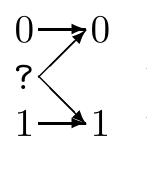

<!-- 源 PDF 物理页 181；原书印刷页 169 -->

如果这些比特差错之间存在复杂的相关性，会怎样？为什么仍有 $I(s;\hat s)\geq NR(1-H_2(p_{\mathrm b}))$？

## 10.6　计算容量

我们已经证明，信道容量就是能够实现可靠通信的最高速率。怎样计算给定离散无记忆信道的容量？需要找到它的最优输入分布。一般来说，可以用计算机搜索：利用互信息对输入概率的导数来寻找最优输入分布。

> **原书旁注**　第 10.6–10.8 节属于进阶内容。首次阅读的读者可以先跳到第 10.9 节（原书印刷页 172）。

▷ **习题 10.2**〔难度 2〕对条件概率为 $Q_{j\mid i}$ 的信道，求互信息 $I(X;Y)$ 对输入概率 $p_i$ 的导数 $\partial I(X;Y)/\partial p_i$。

**习题 10.3**〔难度 2〕证明：互信息 $I(X;Y)$ 是输入概率向量 $\mathbf p$ 的凹函数。

因为 $I(X;Y)$ 对输入分布 $\mathbf p$ 是凹的，所以任何使 $I(X;Y)$ 的导数在可行域内为零的概率分布 $\mathbf p$，都必定是它的全局极大值。因此，很自然地会想把互信息的导数送入一个寻找局部极大值的程序，寻找满足下式的输入分布 $P(x)$：

$$\frac{\partial I(X;Y)}{\partial p_i}=\lambda\quad\text{对所有 }i,\tag{10.22}$$

其中 $\lambda$ 是与约束 $\sum_i p_i=1$ 对应的 Lagrange 乘子。但这条路可能找不到正确答案，因为某些输入的概率 $p_i=0$ 时，$I(X;Y)$ 才可能取最大值。三元混淆信道就是一个简单例子。

**三元混淆信道。** $\mathcal A_X=\{0,?,1\}$，$\mathcal A_Y=\{0,1\}$。

图内 $0$ 一定输出 $0$；$1$ 一定输出 $1$；$?$ 分别以概率 $1/2$ 输出 $0$ 或 $1$。完整的条件概率为：

$$\begin{aligned}
P(y=0\mid x=0)&=1;&P(y=0\mid x=?)&=1/2;&P(y=0\mid x=1)&=0;\\
P(y=1\mid x=0)&=0;&P(y=1\mid x=?)&=1/2;&P(y=1\mid x=1)&=1.
\end{aligned}$$

只要使用输入 $?$，输出就是随机的；另外两个输入则是可靠的。不使用输入 $?$，就能达到最大的 1 比特信息速率。

▷ **习题 10.4**〔难度 2；解答见原书印刷页 173〕画出这个信道的互信息随输入分布 $\mathbf p$ 变化的图。为 $\mathbf p$ 选择一种方便的二维表示。

因此，优化程序必须考虑这种可能：当我们沿 $I(X;Y)$ 的上坡方向前进时，会碰到不等式约束 $p_i\geq0$。

▷ **习题 10.5**〔难度 2；解答见原书印刷页 174〕描述使 $I(X;Y)$ 取得最大值时的条件，它应与式 (10.22) 类似；再描述一个求信道容量的计算机程序。
