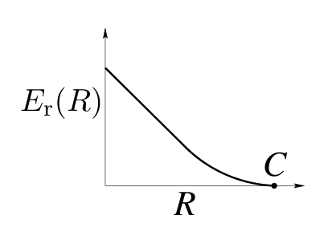

<!-- 源 PDF 物理页 183；原书印刷页 171 -->

对称性很有用，因为后面的章节将会看到：使用线性码，可以在对称信道上以容量速率通信。

**习题 10.10**〔难度 2〕证明：不论一个对称信道有多少个输入，把概率均匀地分配给所有输入，都是一种最优输入分布。

▷ **习题 10.11**〔难度 2；解答见原书印刷页 174〕是否存在不对称信道，但它的最优输入分布却是均匀分布？找出一个例子，或者证明不存在。

## 10.7　其他编码定理

本章证明的有噪信道编码定理非常一般，适用于所有离散无记忆信道；但它并不具体。定理只说：只要使用块长 $N$ **足够大**的码，就能以差错概率 $\epsilon$、速率 $R$ 实现可靠通信。它并没有说明，要达到给定的 $R$ 和 $\epsilon$，$N$ 究竟需要多大。

大概 $\epsilon$ 越小、$R$ 越接近 $C$，所需的 $N$ 就越大。

### 明确给出 $N$ 依赖关系的有噪信道编码定理

对一个离散无记忆信道、块长 $N$ 和速率 $R$，存在长为 $N$ 的块码，使其平均差错概率满足

$$p_{\mathrm B}\leq\exp[-NE_{\mathrm r}(R)],\tag{10.25}$$

其中 $E_{\mathrm r}(R)$ 是该信道的**随机编码指数**（random-coding exponent）：当 $0\leq R<C$ 时，它是 $R$ 的凸、递减、正值函数。随机编码指数也称为可靠性函数。

［通过剔除法论证，还可以证明存在最大差错概率 $p_{\mathrm{BM}}$ 也随 $N$ 指数下降的块码。］

图 10.8　典型的随机编码指数。图内纵轴为 $E_{\mathrm r}(R)$，横轴为速率 $R$，曲线在容量 $C$ 处降至零。

$E_{\mathrm r}(R)$ 的定义见 Gallager（1968，原书印刷页 139）。当 $R\to C$ 时，$E_{\mathrm r}(R)$ 趋于零；图 10.8 画出了该函数的典型行为。计算有实际意义的信道的随机编码指数，是一项困难且已有大量研究投入的工作。即便对二元对称信道这样的简单信道，$E_{\mathrm r}(R)$ 也没有简单表达式。

### 差错概率随块长变化的下界

前面的定理说，存在满足 $p_{\mathrm B}<\exp[-NE_{\mathrm r}(R)]$ 的码。但差错概率最低能到多少？能比这小得多吗？

对离散无记忆信道上任意块长为 $N$ 的码，如果所有信源消息以相同概率使用，差错概率满足

$$p_{\mathrm B}\gtrsim\exp[-NE_{\mathrm{sp}}(R)],\tag{10.26}$$
