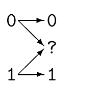
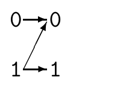

<!-- 源 PDF 物理页 184；原书印刷页 172 -->

其中 $E_{\mathrm{sp}}(R)$ 是信道的**球填充指数**（sphere-packing exponent），在 $0\leq R<C$ 范围内，它是 $R$ 的凸、递减、正值函数。

此结果的精确表述及更多参考文献见 Gallager（1968，原书印刷页 157）。

## 10.8　有噪信道编码定理与编码实践

设想一位客户要为有噪信道购买纠错码和解码器。前述结果使我们可以提供如下服务：他告诉我们信道的性质、所需速率 $R$ 和所需差错概率 $p_{\mathrm B}$；我们求出有关函数 $C$、$E_{\mathrm r}(R)$、$E_{\mathrm{sp}}(R)$ 后，便能告诉他：使用某个块长 $N$，其问题有解；事实上，几乎任意随机选择的该块长码都应能完成任务。遗憾的是，我们还没有找到在实践中实现这类编码器和解码器的办法；当 $N$ 很大时，实现随机码的编码器和解码器的成本将随 $N$ 指数增长。

而且，在实际应用中，客户多半并不确切知道自己面对的信道是什么。因此 Berlekamp（1980）建议：设计多种编码—解码系统，并画出它们在各种理想化信道中的性能随噪声水平变化的曲线，这才是解决纠错问题的合理方式。把这些曲线图（本书原书印刷页 568 有一例）交给客户，他便能在可选系统中作选择，而无须确切描述自己的信道。在这样的实践取向下，函数 $E_{\mathrm r}(R)$ 和 $E_{\mathrm{sp}}(R)$ 的重要性会降低。

## 10.9　进一步习题

 **习题 10.12**〔难度 2〕输入为 $x$、输出为 $y$ 的二元擦除信道，其转移概率矩阵为

$$\mathbf Q=\begin{bmatrix}1-q&0\\q&q\\0&1-q\end{bmatrix}.$$

图内 $0\to0$、$1\to1$ 各以概率 $1-q$，$0\to?$、$1\to?$ 各以概率 $q$。求一般输入分布 $\{p_0,p_1\}$ 下输入与输出的互信息 $I(X;Y)$，并证明此信道的容量为 $C=1-q$ 比特。

$Z$ 信道的转移概率矩阵为

$$\mathbf Q=\begin{bmatrix}1&q\\0&1-q\end{bmatrix}.$$

图内 $0\to0$ 的概率为 1；$1\to0$ 的概率为 $q$，$1\to1$ 的概率为 $1-q$。证明：使用一个 $(2,1)$ 码，使用 $Z$ 信道两次便能模拟擦除信道的一次使用，并指出该擦除信道的擦除概率。由此证明 $Z$ 信道容量 $C_Z\geq\tfrac12(1-q)$ 比特。

解释为什么得到的是不等式 $C_Z\geq\tfrac12(1-q)$，而不是等式。
