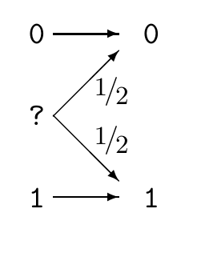
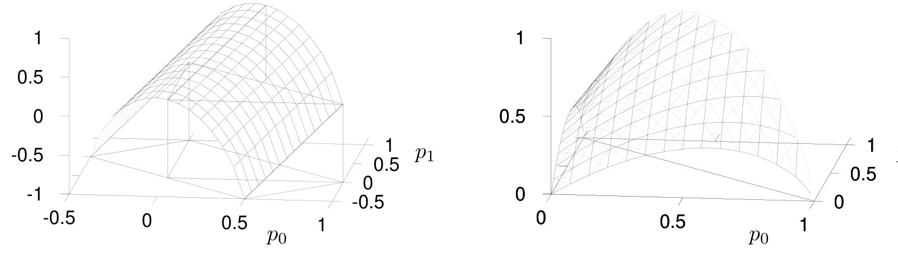

<!-- 源 PDF 物理页 185；原书印刷页 173 -->

**习题 10.13**〔难度 3；解答见原书印刷页 174〕一根跨大西洋电缆中有 $N=20$ 根无法区分的电线。你的任务是查明哪根线对应哪根线，也就是在电缆两端给电线作出一致的标记。你手头的工具只有：把两根或更多电线连成一组，以及用通断测试仪测试是否连通。为完成任务，最少需要横渡大西洋几次？具体如何操作？

对于更大的 $N$，例如 $N=1000$，又该怎样解决？

举个例子：如果 $N=3$，任务可以用两步完成。先在一端给一根线标上 $a$，把另外两根连在一起；渡过大西洋，测出哪两根线连通，给它们标上 $b$、$c$，给未连通的线标上 $a$；接着把 $b$ 接到 $a$ 上，返回大西洋另一端；在那里断开 $b$ 与 $c$ 的连接后，就能推断出 $b$ 和 $c$ 各自是哪根线。

这个问题可以靠持续搜索解决，但它出现在本章，是因为它也可以用一种贪心方法解决：每一步尽量增大所获得的信息。把电线之间尚未知晓的排列记为 $\mathbf x$。在一端选定电线的连接方式 $C$ 之后，可以到另一端测量；测量结果 $\mathbf y$ 将传达关于 $\mathbf x$ 的信息。传达多少？选择哪种连接方式，能使 $\mathbf y$ 所传达的关于 $\mathbf x$ 的信息最多？

## 10.10　解答

**习题 10.4 的解答**（原书印刷页 169）。若输入分布为 $\mathbf p=(p_0,p_?,p_1)$，互信息为

$$I(X;Y)=H(Y)-H(Y\mid X)=H_2(p_0+p_?/2)-p_?.\tag{10.27}$$

有两种办法可以画出这个函数的大致形状：仔细考察函数，或者考察几个特殊情形。

绘图时，采用 $p_0$ 和 $p_1$ 作为 $\mathbf p$ 的两个独立变量，即 $\mathbf p=(p_0,p_?,p_1)=(p_0,1-p_0-p_1,p_1)$。

图内输入 $0$ 一定输出 $0$，输入 $1$ 一定输出 $1$；输入 $?$ 各以概率 $1/2$ 输出 $0$ 或 $1$。

**直接考察。** 如果取 $p_*\equiv p_0+p_?/2$ 和 $p_?$ 作为两个自由度，互信息就变得很简单：$I(X;Y)=H_2(p_*)-p_?$。再换回 $p_0=p_*-p_?/2$、$p_1=1-p_*-p_?/2$，便得到下方左图的大致形状。这个函数如同一条隧道，沿 $p_0$ 和 $p_1$ 都增大的方向升高。为了得到所要求的 $I(X;Y)$ 图形，需要去掉这条“隧道”中处于概率可行单纯形之外的部分；重新画出的曲面只保留 $p_0>0$ 且 $p_1>0$ 的区域。下方右图给出了完整函数图。

原书下方无编号双图：左图是把函数延拓到可行域之外后的“隧道”，右图仅保留概率分布允许的区域；两图的水平轴分别为 $p_0$ 和 $p_1$，竖轴是互信息 $I(X;Y)$。
