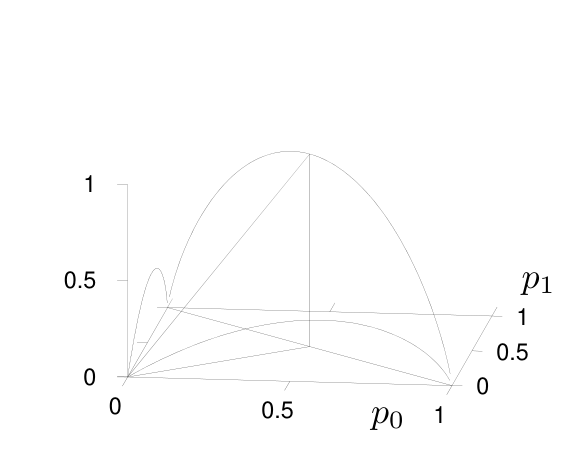

<!-- 源 PDF 物理页 186；原书印刷页 174 -->

**特殊情形。** 若 $p_?=0$，信道就是无噪二元信道，$I(X;Y)=H_2(p_0)$。

若 $p_0=p_1$，则 $H_2(p_0+p_?/2)=1$，所以 $I(X;Y)=1-p_?$。

若 $p_0=0$，信道就是差错概率为 $0.5$ 的 $Z$ 信道。前一章的图 9.3 已经给出它的图形。

这些特殊情形使我们能构造图 10.9 所示的函数骨架。

图 10.9　三元混淆信道的互信息骨架。图内两条水平坐标对应输入概率 $p_0,p_1$，竖直高度对应互信息；图上标出的 $0$、$0.5$、$1$ 是坐标刻度。

**习题 10.5 的解答**（原书印刷页 169）。$\mathbf p$ 使 $I(X;Y)$ 取得最大值的充要条件为

$$\left.\begin{aligned}
\frac{\partial I(X;Y)}{\partial p_i}&=\lambda&&\text{且 }p_i>0,\\
\frac{\partial I(X;Y)}{\partial p_i}&\leq\lambda&&\text{且 }p_i=0
\end{aligned}\right\}\quad\text{对所有 }i,\tag{10.28}$$

其中 $\lambda$ 是一个常数，它与容量的关系为 $C=\lambda+\log_2 e$。

这个结果可以用于一种计算机程序：程序求各导数，并按照导数之间的差异成比例地增减各输入概率 $p_i$。

它对擅长猜测的“懒人”容量求解者也很有用：猜出最优输入分布后，只需检查它是否满足式 (10.28)。

**习题 10.11 的解答**（原书印刷页 171）。我们当然会预期存在最优输入分布均匀、信道却不对称的例子。设计一个信道时有 $I(J-1)$ 个自由度，而最优输入分布只有 $(I-1)$ 个维度。因此，在对称信道附近的 $I(J-1)$ 维扰动空间里，我们预期存在一个维度为 $I(J-1)-(I-1)=I(J-2)+1$ 的子空间，其中的扰动不会改变最优输入分布。

下面是一个明确的例子，有点像 $Z$ 信道：

$$\mathbf Q=\begin{bmatrix}
0.9585&0.0415&0.35&0.0\\
0.0415&0.9585&0.0&0.35\\
0&0&0.65&0\\
0&0&0&0.65
\end{bmatrix}.\tag{10.29}$$

**习题 10.13 的解答**（原书印刷页 173）。对任意 $N>2$，只需两次横渡大西洋（一去一回），便能解决电线标记问题。

用信息论方法解这个问题，关键一步是写出一种**划分**的信息量；“划分”这个组合对象，就是把若干组电线分别连接在一起。若把 $N$ 根电线划分为 $g_1$ 个大小为 1 的子集、$g_2$ 个大小为 2 的子集，依此类推，则这类划分的总数为

$$\Omega=\frac{N!}{\prod_r(r!)^{g_r}g_r!},\tag{10.30}$$

而一种划分的信息量，就是这一数量的对数。采用贪心策略时，先选使该信息量最大的一种划分。

一种做法是把 $g_r$ 视为实数，在约束 $\sum_r g_r r=N$ 下使信息量最大。为这个约束引入 Lagrange 乘子 $\lambda$，则导数是

$$\frac{\partial}{\partial g_r}\left(\log\Omega+\lambda\sum_r g_r r\right)=-\log r!-\log g_r+\lambda r,\tag{10.31}$$
