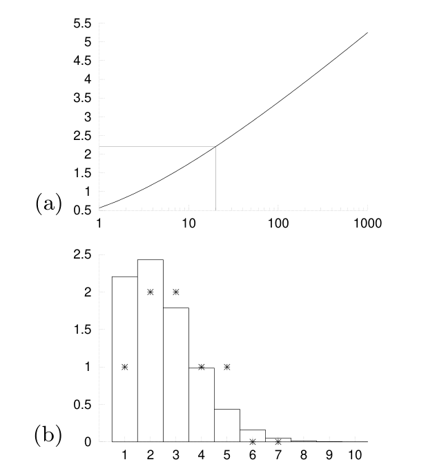

<!-- 源 PDF 物理页 187；原书印刷页 175 -->

令这个导数为零，得到一个颇为漂亮的表达式：

$$g_r=\frac{e^{\lambda r}}{r!};\tag{10.32}$$

最优 $g_r$ 与 Poisson 分布成正比！把 $g_r$ 代回约束 $\sum_r g_r r=N$，即可求 Lagrange 乘子；得到的隐式方程是

$$N=\mu e^\mu,\tag{10.33}$$

其中 $\mu\equiv e^\lambda$ 是 Lagrange 乘子的一种方便的重新参数化。

图 10.10a 画出了 $\mu(N)$；图 10.10b 则画出 $\mu=2.2$ 时算出的非整数 $g_r$，以及附近的整数 $g_r=\{1,2,2,1,1\}$。这些整数启发我们把第一种划分设为 `(a)(bc)(de)(fgh)(ijk)(lmno)(pqrst)`。

图 10.10　使用 Lagrange 乘子近似求解电线标记问题。（a）参数 $\mu$ 随 $N$ 的变化；图中突出显示 $\mu(20)=2.2$。（b）曲线或柱线给出 $g_r=\mu^r/r!$ 的非整数值，叉号给出由这些值启发的整数 $g_r$。图内（a）横轴为 $N$、纵轴为 $\mu$；（b）横轴为子集大小 $r$、纵轴为子集个数 $g_r$。

这种划分会在另一端产生随机划分，其信息量为 $\log\Omega=40.4$ 比特，比推断跨大西洋电线排列所需的总信息量 $\log20!\simeq61$ 比特的一半还多得多。［相比之下，若所有电线都两两连接，产生的信息量只有约 29 比特。］第二种划分该怎样选，留给读者考虑。符合 Shannon 思路的办法是：在另一端也用相同的 $\{g_r\}$ 随机选一种划分；要确保两种划分尽可能不同。

如果 $N\ne2,5,9$，电线标记问题还有一种特别容易实施的解法，称为 **Knowlton–Graham 划分**：以两种方式 $A$ 和 $B$ 把 $\{1,\ldots,N\}$ 划分为不相交的子集，并要求对每一组 $j,k$，至多有一个元素同时属于 $A$ 中一个大小为 $j$ 的子集和 $B$ 中一个大小为 $k$ 的子集（Graham，1966；Graham 和 Knowlton，1968）。
