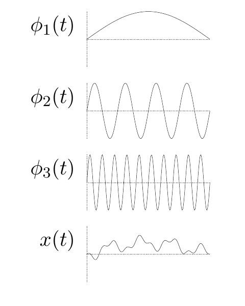

<!-- 源 PDF 物理页 190；原书印刷页 178 -->

这样的信道怎样传递信息？考虑在时长为 $T$ 的信号中传送一组 $N$ 个实数 $\{x_n\}_{n=1}^{N}$。信号由一组正交归一基函数 $\phi_n(t)$ 的加权组合构成：

$$x(t)=\sum_{n=1}^{N}x_n\phi_n(t),\tag{11.7}$$

其中 $\int_0^T\mathrm dt\,\phi_n(t)\phi_m(t)=\delta_{nm}$。接收方随后可计算这些标量：

$$y_n=\int_0^T\mathrm dt\,\phi_n(t)y(t)=x_n+\int_0^T\mathrm dt\,\phi_n(t)n(t)\tag{11.8}$$

$$=x_n+n_n,\tag{11.9}$$

这里 $n=1,\ldots,N$。如果没有噪声，$y_n$ 就等于 $x_n$。白高斯噪声 $n(t)$ 给估计值 $y_n$ 加上了标量噪声 $n_n$，而该噪声服从高斯分布：

$$n_n\sim\operatorname{Normal}(0,N_0/2),\tag{11.10}$$

其中 $N_0$ 是上页引入的噪声谱密度。因此，按上述方式使用的连续信道，等价于式 (11.5) 定义的高斯信道。功率约束 $\int_0^T\mathrm dt\,[x(t)]^2\leq PT$ 对信号幅度 $x_n$ 施加了约束：

$$\sum_n x_n^2\leq PT\quad\Longrightarrow\quad\overline{x_n^2}\leq\frac{PT}{N}.\tag{11.11}$$

图 11.1　三种基函数，以及它们的加权组合 $x(t)=\sum_{n=1}^{N}x_n\phi_n(t)$；这里 $x_1=0.4$、$x_2=-0.2$、$x_3=0.1$。图内从上到下依次为 $\phi_1(t)$、$\phi_2(t)$、$\phi_3(t)$ 和合成信号 $x(t)$。

在回到高斯信道之前，先定义连续信道的带宽（bandwidth，单位为赫兹）：

$$W=\frac{N^{\max}}{2T},\tag{11.12}$$

其中 $N^{\max}$ 是长度为 $T$ 的时间区间内能够构造出的正交归一函数的最大个数。我们可以这样理解这一定义：用最高频率为 $W$ 的正交余弦曲线和正弦曲线，构造一个时长为 $T$ 的带限信号。这些正交函数的个数为 $N^{\max}=2WT$。这一定义与 Nyquist 采样定理有关：如果信号中的最高频率为 $W$，那么每隔 Nyquist 间隔 $\Delta t=1/(2W)$ 秒取一次样，由这些离散采样点的数值即可完全确定信号。

所以，使用带宽为 $W$、噪声谱密度为 $N_0$、功率为 $P$ 的连续实值信道，等价于每秒使用 $N/T=2W$ 次高斯信道；每次使用的噪声水平为 $\sigma^2=N_0/2$，信号功率约束为 $\overline{x_n^2}\leq P/(2W)$。

### $E_b/N_0$ 的定义

设高斯信道 $y_n=x_n+n_n$ 配合某种编码系统使用，每次使用信道传送 $R$ 比特二元信源数据。怎样比较通信速率 $R$ 和信号功率 $\overline{x_n^2}$ 都不相同的两种编码系统？速率 $R$ 大固然好，信号功率小也好。

通常用每个信源比特对应的功率 $E_b=\overline{x_n^2}/R$ 与噪声谱密度 $N_0$ 的比值，来衡量计入速率因素后的信噪比：

$$E_b/N_0=\frac{\overline{x_n^2}}{2\sigma^2R}.\tag{11.13}$$

$E_b/N_0$ 是比较高斯信道编码方案时使用的指标之一。

> **原书旁注**　$E_b/N_0$ 是无量纲量，但通常以分贝报告；这里给出的数值为 $10\log_{10}(E_b/N_0)$。
