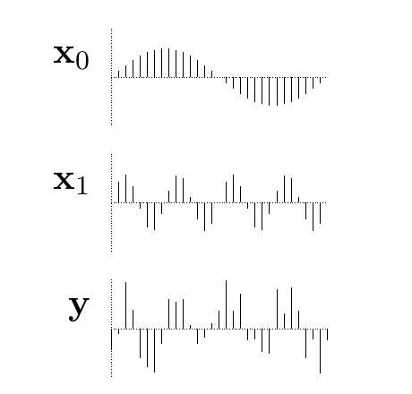
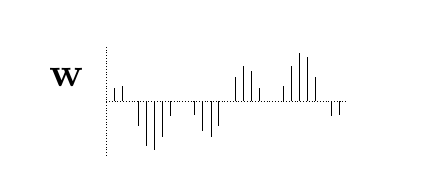

<!-- 源 PDF 物理页 191；原书印刷页 179 -->

## 11.2　推断实值信道的输入

### “脉冲的最佳检测”

1944 年，Shannon 写过一份备忘录（Shannon，1993），研究这样的问题：已知两种脉冲的形状，用向量 $\mathbf x_0$ 和 $\mathbf x_1$ 表示；其中一种脉冲经有噪信道传输后，怎样最好地区分它们？这是一个模式识别问题。假设噪声为高斯分布，其概率密度为

$$P(\mathbf n)=\left[\det\!\left(\frac{\mathbf A}{2\pi}\right)\right]^{1/2}\exp\!\left(-\frac12\mathbf n^{\mathsf T}\mathbf A\mathbf n\right),\tag{11.14}$$

其中 $\mathbf A$ 是噪声方差－协方差矩阵的逆矩阵，是对称的正定矩阵。［如果 $\mathbf A$ 是单位矩阵的倍数 $\mathbf I/\sigma^2$，噪声就是“白”的；对于更一般的 $\mathbf A$，噪声则是“有色”的。］若信源信号是 $s$（取值为零或一），接收向量 $\mathbf y$ 的概率为

$$P(\mathbf y\mid s)=\left[\det\!\left(\frac{\mathbf A}{2\pi}\right)\right]^{1/2}\exp\!\left[-\frac12(\mathbf y-\mathbf x_s)^{\mathsf T}\mathbf A(\mathbf y-\mathbf x_s)\right].\tag{11.15}$$

图 11.2　两个脉冲 $\mathbf x_0$ 和 $\mathbf x_1$，以 31 维向量表示；$\mathbf y$ 是其中一个脉冲的带噪版本。图内自上而下依次为 $\mathbf x_0$、$\mathbf x_1$ 和 $\mathbf y$。

最优检测器依据后验概率之比作出判断：

$$\frac{P(s=1\mid\mathbf y)}{P(s=0\mid\mathbf y)}=\frac{P(\mathbf y\mid s=1)P(s=1)}{P(\mathbf y\mid s=0)P(s=0)}\tag{11.16}$$

$$=\exp\!\left[-\frac12(\mathbf y-\mathbf x_1)^{\mathsf T}\mathbf A(\mathbf y-\mathbf x_1)+\frac12(\mathbf y-\mathbf x_0)^{\mathsf T}\mathbf A(\mathbf y-\mathbf x_0)+\ln\frac{P(s=1)}{P(s=0)}\right]$$

$$=\exp\!\left(\mathbf y^{\mathsf T}\mathbf A(\mathbf x_1-\mathbf x_0)+\theta\right),\tag{11.17}$$

其中 $\theta$ 是一个与接收向量 $\mathbf y$ 无关的常数：

$$\theta=-\frac12\mathbf x_1^{\mathsf T}\mathbf A\mathbf x_1+\frac12\mathbf x_0^{\mathsf T}\mathbf A\mathbf x_0+\ln\frac{P(s=1)}{P(s=0)}.\tag{11.18}$$

如果检测器必须作出决定（即猜测 $s=1$ 或 $s=0$），那么，使错误概率最小的决定就是选择概率较大的假设。可以用判别函数（discriminant function）来表示最优决策：

$$a(\mathbf y)=\mathbf y^{\mathsf T}\mathbf A(\mathbf x_1-\mathbf x_0)+\theta\tag{11.19}$$

相应的决策为

$$\begin{aligned}a(\mathbf y)>0&\quad\longrightarrow\quad\text{猜测 }s=1,\\a(\mathbf y)<0&\quad\longrightarrow\quad\text{猜测 }s=0,\\a(\mathbf y)=0&\quad\longrightarrow\quad\text{两者均可。}\end{aligned}\tag{11.20}$$

注意，$a(\mathbf y)$ 是接收向量的线性函数：

$$a(\mathbf y)=\mathbf w^{\mathsf T}\mathbf y+\theta,\tag{11.21}$$

其中 $\mathbf w=\mathbf A(\mathbf x_1-\mathbf x_0)$。

图 11.3　用于区分 $\mathbf x_0$ 与 $\mathbf x_1$ 的权重向量 $\mathbf w\propto\mathbf x_1-\mathbf x_0$。图内纵向条线给出 $\mathbf w$ 的各分量。

## 11.3　高斯信道的容量

到目前为止，我们只度量过离散变量的联合熵、边缘熵和条件熵。要定义连续变量所传达的信息，必须处理两个问题：实数轴有无限长度，而实数有无限精度。
