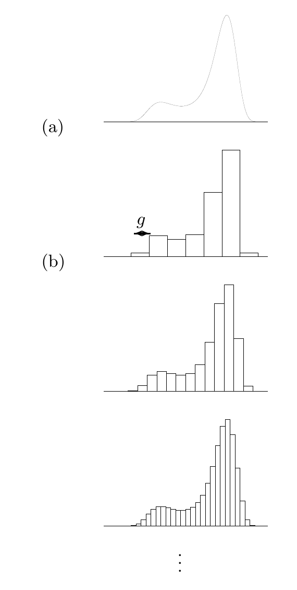

<!-- 源 PDF 物理页 192；原书印刷页 180 -->

### 无限多个输入

一次使用高斯信道能传送多少信息？假如允许向高斯信道输入**任意**实数 $x$，我们就可以把一长串 $N$ 位数字 $d_1d_2d_3\cdots d_N$ 编成 $x=d_1d_2d_3\cdots d_N000\cdots000$ 来通信。增大 $N$，单次传输的无差错信息量就可以任意大；在 $x$ 末尾增加零的个数，通信也可以变得任意可靠。然而，较大的输入通常需要付出一定功率代价；即使不考虑功率，接收器能接受的动态范围在实际中也有限。因此，通常要为每个输入 $x$ 定义一个代价函数 $v(x)$，并限制码的平均代价 $\bar v$ 不超过某个最大值。可以证明一个包含输入代价函数的广义信道编码定理，参见 McEliece（1977）。所得的信道容量 $C(\bar v)$ 随允许的代价而变。对高斯信道，我们假设代价函数为

$$v(x)=x^2\tag{11.22}$$

从而限制输入的“平均功率”$\overline{x^2}$。上文讨论实际电信道时，物理功耗确实与 $x$ 的平方成正比，这也说明了采用这个代价函数的理由。约束 $\overline{x^2}=\bar v$ 使我们无法通过一次高斯信道使用来传送无限多的信息。

### 无限精度

很容易想把离散变量的联合熵、边缘熵和条件熵中的求和改成积分，用来定义实值变量的熵；但这种操作定义得并不好。把一个区间划分得越来越细时，所得离散分布的熵会发散（随分割粒度的对数变化，见图 11.4）。此外，对有量纲的量取对数是不允许的，例如概率密度 $P(x)$ 的量纲为 $[x]^{-1}$。

图 11.4　(a) 概率密度 $P(x)$。问题：能否定义这个密度的“熵”？(b) 可以对一系列划分粒度 $g$ 逐渐减小的概率分布计算熵，但这些熵趋向于 $\int P(x)\log\frac1{P(x)g}\,\mathrm dx$，并不独立于 $g$：每当 $g$ 减半，熵就增加一比特。积分 $\int P(x)\log\frac1{P(x)}\,\mathrm dx$ 不合法。图内 (b) 的箭头表示直方图分箱宽度 $g$，下方省略号表示继续细分。

不过，有一个信息量的极限表现良好，那就是互信息。这也是我们真正关心的量，因为它衡量一个变量向另一个变量传达了多少信息。在离散情形，

$$I(X;Y)=\sum_{x,y}P(x,y)\log\frac{P(x,y)}{P(x)P(y)}.\tag{11.23}$$

这里，对数的自变量是同一空间中两个概率的比值，因此可以让 $P(x,y)$、$P(x)$ 和 $P(y)$ 成为概率密度，再把求和换成积分：

$$I(X;Y)=\int\!\mathrm dx\,\mathrm dy\,P(x,y)\log\frac{P(x,y)}{P(x)P(y)}\tag{11.24}$$

$$=\int\!\mathrm dx\,\mathrm dy\,P(x)P(y\mid x)\log\frac{P(y\mid x)}{P(y)}.\tag{11.25}$$

现在可以针对高斯信道提出两个问题：(a) 在约束 $\overline{x^2}=v$ 下，什么概率分布 $P(x)$ 使互信息最大？(b) 像离散信道一样，这个最大的互信息是否仍衡量该实值信道可达到的最大无差错通信速率？
