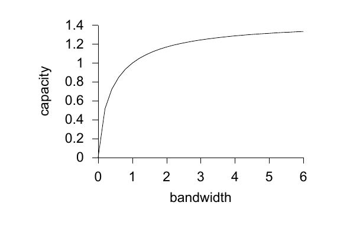

<!-- 源 PDF 物理页 194；原书印刷页 182 -->

### 有噪信道编码定理的几何图景：球体填充

考虑输入序列 $\mathbf x=(x_1,\ldots,x_N)$ 及相应的输出 $\mathbf y$，它们各自都是 $N$ 维空间中的一个点。当 $N$ 很大时，噪声功率很可能在相对意义上接近 $N\sigma^2$。因此，输出 $\mathbf y$ 很可能靠近以 $\mathbf x$ 为球心、半径为 $\sqrt{N\sigma^2}$ 的球面。同样，若原始信号 $\mathbf x$ 是在平均功率约束 $\overline{x^2}=v$ 下随机产生的，那么 $\mathbf x$ 很可能靠近以原点为球心、半径为 $\sqrt{Nv}$ 的球面；又因为 $\mathbf y$ 的总平均功率为 $v+\sigma^2$，接收信号 $\mathbf y$ 很可能落在以原点为球心、半径为 $\sqrt{N(v+\sigma^2)}$ 的球面上。

半径为 $r$ 的 $N$ 维球体，其体积为

$$V(r,N)=\frac{\pi^{N/2}}{\Gamma(N/2+1)}r^N.\tag{11.31}$$

现在考虑用彼此不会混淆的输入 $\mathbf x$ 建立通信系统，也就是让它们对应的球体没有显著重叠。把可能出现的 $\mathbf y$ 所在球体的体积，除以给定 $\mathbf x$ 时 $\mathbf y$ 所在球体的体积，就得到不会混淆的输入数 $S$ 的上界：

$$S\leq\left(\frac{\sqrt{N(v+\sigma^2)}}{\sqrt{N\sigma^2}}\right)^N.\tag{11.32}$$

因此，容量受到以下界限约束：

$$C=\frac1N\log M\leq\frac12\log\left(1+\frac{v}{\sigma^2}\right).\tag{11.33}$$

> **技术译注（非原书正文）**　原书式 (11.32) 用 $S$ 表示输入数，紧接着的式 (11.33) 改用 $M$；这里照原式保留两个符号。

像上一章那样给出更详细的论证，可以证明这里取等号。

### 回到连续信道

回想一下，使用带宽为 $W$、噪声谱密度为 $N_0$、功率为 $P$ 的连续实值信道，等价于每秒使用 $N/T=2W$ 次高斯信道；每次使用的噪声水平为 $\sigma^2=N_0/2$，信号功率约束为 $\overline{x_n^2}\leq P/(2W)$。代入高斯信道的容量，就得到连续信道的容量：

$$C=W\log\left(1+\frac{P}{N_0W}\right)\quad\text{比特/秒}.\tag{11.34}$$

这个公式有助于理解实际通信中的取舍。设功率约束固定：多大的带宽最能发挥这份功率的作用？引入 $W_0=P/N_0$，即信噪比为 1 时对应的带宽。图 11.5 画出 $C/W_0=(W/W_0)\log(1+W_0/W)$ 随 $W/W_0$ 的变化。容量随带宽增加而趋近于渐近值 $W_0\log e$。对固定功率而言，在大带宽上以低信噪比通信，容量远好于在窄带宽上以高信噪比通信。这是宽带通信方法的一个动机，例如 3G 手机使用的“直接序列扩频”方法。当然，我们并非独自使用电磁频谱；若占用很宽的带宽，周围其他使用者未必乐意。因此，从社会层面考虑，工程师常不得不采用功率更高、带宽更窄的发射机。

图 11.5　实值信道的容量与带宽的关系：$C/W_0=(W/W_0)\log(1+W_0/W)$，横轴为 $W/W_0$，纵轴为 $C/W_0$；原图轴标分别为 bandwidth（带宽）和 capacity（容量）。
