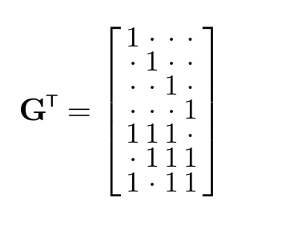

<!-- 源 PDF 物理页 195；原书印刷页 183 -->

## 11.4　实用纠错码能做到什么？

几乎所有码都是好码，但几乎所有码若要真正实现编码器和解码器，都需要大小随块长 $N$ 指数增长的查找表。而编码定理又要求 $N$ 很大。

所谓**实用的纠错码**，是指能在合理时间内编码和解码的码。例如，运行时间随块长 $N$ 按多项式增长；最好是线性增长。

### 实践中尚未达到 Shannon 极限

有噪信道编码定理的非构造性证明表明，任何有噪信道都存在好块码；事实上，几乎所有块码都是好码。但要明确写出一种实用编码器和解码器，达到 Shannon 所保证的性能，仍是一个未解决的问题。

**非常好的码。** 给定信道，若一个块码族能在直到该信道容量的任意通信速率下把差错概率压到任意小，就称它是该信道的“非常好的码”。

**好的码。** 若一个码族能在从非零速率到某个最高速率的范围内把差错概率压到任意小，就称它是好码；这一最高速率可以低于给定信道的容量。

**不好的码。** 若一个码族无法把差错概率压到任意小，或者只有把信息速率降到零时才能做到，就称它是不好的码。重复码族就是一例。（不好的码未必没有实际用途。）

**实用的码。** 若一个码族的编码和解码所需时间、空间随块长按多项式增长，就称它是实用的码。

### 大多数成熟码都是线性码

先回顾块码的定义，再定义线性块码。

**信道 $Q$ 的 $(N,K)$ 块码**，是 $S=2^K$ 个码字的列表 $\{\mathbf x^{(1)},\mathbf x^{(2)},\ldots,\mathbf x^{(2^K)}\}$，每个码字长为 $N$，$\mathbf x^{(s)}\in\mathcal A_X^N$。待编码信号 $s$ 来自大小为 $2^K$ 的字母表，并被编码为 $\mathbf x^{(s)}$。

**线性 $(N,K)$ 块码**是一种块码，其码字 $\{\mathbf x^{(s)}\}$ 构成 $\mathcal A_X^N$ 中的一个 $K$ 维子空间。编码运算可以用一个 $N\times K$ 二元矩阵 $\mathbf G^\mathsf T$ 表示：如果待编码信号的二进制表示为长 $K$ 比特的向量 $\mathbf s$，则编码后的信号为 $\mathbf t=\mathbf G^\mathsf T\mathbf s\pmod 2$。

也可以把码字集合 $\{\mathbf t\}$ 定义为满足 $\mathbf H\mathbf t=\mathbf0\pmod2$ 的向量集合，其中 $\mathbf H$ 是该码的**奇偶校验矩阵**（parity-check matrix）。

例如，第 1.2 节的 $(7,4)$ Hamming 码取 $K=4$ 个信号比特 $\mathbf s$，在它们后面接上三个奇偶校验比特一起发送。$N=7$ 个发送符号由 $\mathbf G^\mathsf T\mathbf s\pmod2$ 给出。

原书无编号矩阵：$\mathbf G^\mathsf T$ 的前四行是单位矩阵；后三行依次为 $(1,1,1,0)$、$(0,1,1,1)$、$(1,0,1,1)$。图内点号代表 $0$，数字 $1$ 保持原值。

编码理论始于 Hamming 的工作。他发明了一族实用纠错码，每一种都能纠正长为 $N$ 的块中的一个差错；其中重复码 $R_3$ 和 $(7,4)$ 码是
