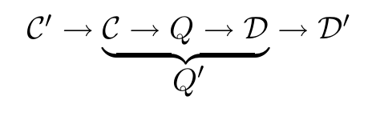

<!-- 源 PDF 物理页 196；原书印刷页 184 -->

最简单的两种。此后，大多数成熟的码都是 Hamming 码的推广，例如 Bose–Chaudhury–Hocquenghem 码、Reed–Müller 码、Reed–Solomon 码和 Goppa 码。

### 卷积码

另一类线性码是**卷积码**。它不把信源数据流分成块，而是连续地读取和发送比特。发送的比特是过去信源比特的线性函数。通常，产生发送比特的规则是：把当前信源比特送入一个长为 $k$ 的线性反馈移位寄存器，然后在每次迭代中，发送寄存器状态的一个或多个线性函数值。由此产生的发送比特流，就是信源比特流与一个线性滤波器的卷积。该滤波器的脉冲响应持续时间可以有限，也可以无限，取决于反馈移位寄存器的选择。

第 48 章将讨论卷积码。

### 线性码是“好码”吗？

有人或许会问：实践中尚未达到 Shannon 极限，是不是因为线性码天生不如随机码？答案是否定的：至少对某些信道，有噪信道编码定理也能在线性码上得到证明（见第 14 章），尽管这类证明和 Shannon 对随机码的证明一样，都是非构造性的。

在线性码的编码端，实现很容易。解码也容易吗？未必。一般的解码问题——在方程 $\mathbf G^\mathsf T\mathbf s+\mathbf n=\mathbf r$ 中找出最大似然的 $\mathbf s$——实际上是 NP 完全问题（Berlekamp 等，1978）。［NP 完全问题是一类计算问题，它们相互之间同样困难，并且普遍被认为在一般情形下需要指数级的计算时间。］因此，人们把注意力集中在那些具有快速解码算法的码族上。

### 串接

构造具有实用解码器的码，有一个技巧是**串接**（concatenation）。

一个“编码器—信道—解码器”系统 $\mathcal C\to Q\to\mathcal D$ 可以看作一个**超级信道** $Q'$：它的差错概率较低，但差错之间存在复杂相关性。我们可以为这个超级信道 $Q'$ 再构造编码器 $\mathcal C'$ 和解码器 $\mathcal D'$。由外码 $\mathcal C'$ 后接内码 $\mathcal C$ 构成的码，称为串接码。

原书无编号流程图：$\mathcal C'\to\mathcal C\to Q\to\mathcal D\to\mathcal D'$；下方大括号把内码 $\mathcal C$、原信道 $Q$ 和内码解码器 $\mathcal D$ 合称为等效超级信道 $Q'$。

有些串接码还使用**交织**（interleaving）。我们按块读取数据，每块的长度大于组成码 $\mathcal C$ 和 $\mathcal C'$ 的块长。用码 $\mathcal C'$ 编完一个数据块后，在块内重新排列这些比特，使原本相邻的比特进入第二个码 $\mathcal C$ 时彼此分开。一个简单交织器的例子是**矩形码**或**乘积码**：将数据排成 $K_2\times K_1$ 的矩形块，先沿水平方向用 $(N_1,K_1)$ 线性码编码，再沿竖直方向用 $(N_2,K_2)$ 线性码编码。

▷ **习题 11.3**〔难度 3〕说明这两个码中的任意一个都可视为内码，另一个视为外码。

例如，图 11.6 给出了一个乘积码：先沿水平方向使用重复码 $R_3$（也称为 Hamming 码 $H(3,1)$），
