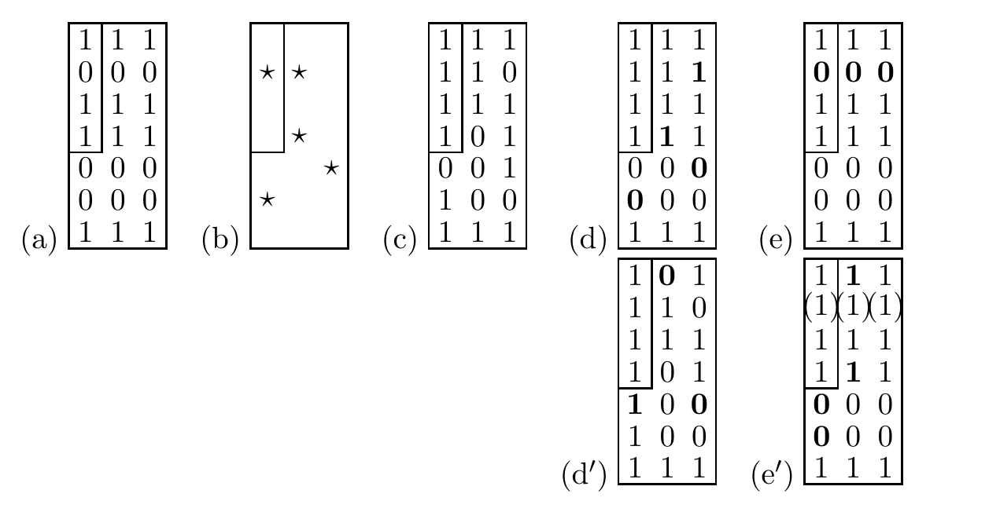

<!-- 源 PDF 物理页 197；原书印刷页 185 -->

图 11.6　一个乘积码。（a）字符串 `1011` 由 Hamming 码 $H(3,1)$ 与 $H(7,4)$ 串接编码。（b）翻转 5 个比特的噪声图案；星号标出这 5 处翻转。（c）接收向量。（d）先用水平 $(3,1)$ 解码器得到的阵列；（e）随后再用竖直 $(7,4)$ 解码器得到的阵列，结果与原码字一致。（d′、e′）若按相反顺序解码，最后仍留有三个差错。图中保留了各阵列的全部 0/1、粗体位、框线及（e′）三个带圈的错误位；（a）中的小矩形标出四个信源比特。

然后沿竖直方向使用 $H(7,4)$。串接码的块长为 27。每个码字含四个信源比特，见图中的小矩形。

> **技术译注（非原书正文）**　原书正文此处印为“27”，图 11.6（a）的位阵列则为 7 行、3 列；两处信息均按原页保留。

利用各子码自己的解码器，按某个顺序逐一解码，是一种方便的办法，虽然它不是最优解码。最合理的是先解码码率最低、因而纠错能力最强的那个码。

图 11.6（c–e）展示了：收到图 11.6a 中的码字，但发生一些差错（如图所示翻转了五位）时，先用 $H(3,1)$ 解码器，再用 $H(7,4)$ 解码器，会发生什么。第一个解码器纠正了三处差错，但第二行有两位出错，它却把该行第三位错误地改掉了。随后，$(7,4)$ 解码器可以纠正这三处差错。

图 11.6（d′–e′）展示了反过来解码的结果。第一列和第二列各有两处差错，于是 $(7,4)$ 解码器又引入了两处新差错；它纠正了第三列的一处差错。随后，$(3,1)$ 解码器清除了其中四处差错，却错误地推断了第二个比特。

### 交织

交织的动机是：把一个码中彼此相邻的比特分散开，就有可能忽略内码所产生的差错之间复杂的相关性。内码可能把整个码字都弄错；但这个码字的比特被逐一分散到外码的多个码字中。因此，可以把内码引入的差错近似当作相互独立。

### 其他信道模型

编码理论工作者除了考虑二元对称信道和高斯信道，也会考虑更复杂的信道。

**突发差错信道**是实践中很重要的模型。Reed–Solomon 码把元素个数很多（例如 $2^{16}$ 个）的 Galois 域（见附录 C.1）作为输入字母表，因此自动具有一定的抗突发差错能力：即使连续 17 个比特被破坏，在 Galois 域表示中也只会破坏相邻两个符号。串接与交织还能进一步抵御突发差错。数字光盘采用的串接 Reed–Solomon 码，可以纠正长度达 4000 比特的突发差错。
