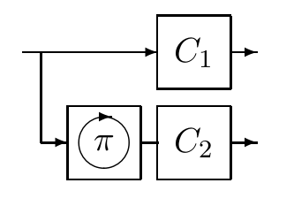

<!-- 源 PDF 物理页 198；原书印刷页 186 -->

▷ **习题 11.4**〔难度 2；解答见原书印刷页 189〕交织使突发差错可以被当作独立差错处理，因而广泛使用；但若按所需冗余量衡量，在理论上它并不是保护数据免遭突发差错的好办法。请用下面的突发差错信道解释原因。时间被分成每块 $N=100$ 个时钟周期；每块以概率 $b=0.2$ 遭遇一次突发差错。突发期间，信道是翻转概率 $f=0.5$ 的二元对称信道；没有突发时，信道是无差错二元信道。求这个信道的容量，并与使用交织、把差错当作独立差错时可能达到的最高通信速率比较。

**衰落信道**（fading channel）与高斯信道一样是真实信道，但假定接收功率随时间变化。移动中的手机是一个重要例子。传入的无线电信号经附近物体反射，产生干涉图案，因此手机收到的信号强度随其位置变化。手机天线只需移动约等于无线电波长的距离（几厘米），接收功率就可能轻易变化 10 分贝，即相差 10 倍。

## 11.5　当前技术水平

通过高斯信道通信，已知最好的码是什么？所有实用码都是线性码，其基础要么是卷积码，要么是块码。

### 卷积码及其衍生码

**教科书式卷积码。** 卫星通信事实上的“标准”纠错码，是约束长度为 7 的卷积码。第 48 章讨论卷积码。

**串接卷积码。** 上述卷积码可以用作串接码的内码，外码则是符号长为 8 比特的 Reed–Solomon 码。Voyager 航天器等深空通信系统就采用了这种码。若要进一步阅读 Reed–Solomon 码，可参见 Lin 和 Costello（1983）。

**Galileo 使用的码。** 喷气推进实验室开发了一种形式相同、但卷积码的约束长度更长（15）、Reed–Solomon 码也更大的码（Swanson，1988）。JPL 未对外公布这种码的细节，而且只有用一间屋子装满专用硬件才能解码。1992 年，它是当时已知最好的码，速率为 $1/4$。

**Turbo 码。** 1993 年，Berrou、Glavieux 和 Thitimajshima 报告了关于 Turbo 码的研究。Turbo 码的编码器基于两个卷积码编码器。信源比特分别送入两台编码器，但送入其中一台时，比特顺序经过随机置换；随后发送这两个组成码产生的奇偶校验比特。

图 11.7　Turbo 码的编码器。方框 $C_1$、$C_2$ 各包含一个卷积码；信源比特经置换 $\pi$ 重排后再输入 $C_2$。把两台卷积编码器的输出串接或交织，就得到待发送的码字。随机置换在设计码时选定，此后固定不变。图内上支路直接进入 $C_1$，下支路先经过 $\pi$ 再进入 $C_2$。

解码算法反复用每个组成码的标准解码算法解码，再把这个解码器的输出当作另一个解码器的输入。这种解码算法
