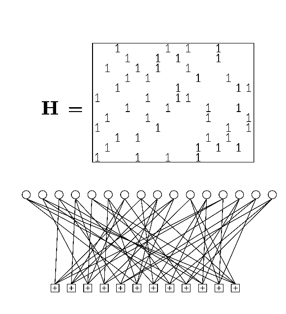

<!-- 源 PDF 物理页 199；原书印刷页 187 -->

是名为 **sum–product 算法**的一种消息传递算法。

第 48 章讨论 Turbo 码；第 16、17、25、26 章讨论消息传递。

### 块码

**Gallager 的低密度奇偶校验码。** 已知对高斯信道最好的块码由 Gallager 于 1962 年发明，但很快被编码理论界大多数人遗忘。1995 年，人们重新发现了这类码，并证明它们在理论和实践上都有出色的性质。与 Turbo 码一样，它们也通过消息传递算法解码。

第 47 章将讨论这些结构非常简洁的码。

图 11.8　一个低密度奇偶校验矩阵及其对应的二部图，表示块长 $N=16$、含 $M=12$ 个约束、码率为 $1/4$ 的低密度奇偶校验码。矩阵 $\mathbf H$ 的每个 `1` 对应图中的一条连线。上方每个白圆代表一个发送比特，每个比特参加 $j=3$ 个约束；下方带加号的方框代表约束，每个约束要求所连接的 $k=4$ 个比特之和为偶数。这是一个 $(16,4)$ 码。当块长增加到 $N\simeq10,000$ 时，可得到出色的性能。

图 47.17（原书印刷页 568）比较了上述码在高斯信道上的表现。

## 11.6　小结

**随机码**是好码，但其编码和解码需要指数级的资源。

**非随机码**大多不如随机码。对非随机码，编码可能容易；但即便是定义简单的线性码，解码仍可能非常困难。

**最好的实用码**：（a）使用很大的块长；（b）采用半随机的码构造；（c）使用基于概率的解码算法。

## 11.7　非线性码

实际使用的码大多是线性码，但也有例外。数字音轨以二进制图案编码到电影胶片上。胶片可能遭遇的差错来自灰尘和划痕，它们会分别产生大量的 1 和 0。我们不希望任何码字看起来像全 1 或全 0，这样才容易发现灰尘或划痕导致的差错。一种用于影院数字声音系统的码是非线性的 $(8,6)$ 码：从 $\binom84$ 种重为 4 的八位二进制图案中取 64 种。

## 11.8　噪声以外的差错

接收方的不确定性还有一个来源：发送信号 $x(t)$ 的**时间定位**。通常的编码理论和信息论假定发送方的时间 $t$ 与接收方的时间 $u$ 完全同步。但如果接收方收到信号 $y(u)$，而接收方时间 $u$ 与发送方时间 $t$ 的关系 $u(t)$ 并不能被准确获知，这个信道的通信容量就会下降。与此前讨论的同步信道相比，这类信道的理论尚不完整。连存在同步差错的信道容量都还不知道（Levenshtein，1966；Ferreira 等，1997）；为这类信道设计可靠通信码，仍是活跃的研究方向（Davey 和 MacKay，2001）。
