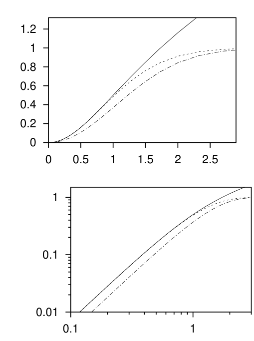

<!-- 源 PDF 物理页 202；原书印刷页 190 -->

交织丢掉了有关差错相关性的有用信息。从理论上说，若码和解码器明确把突发差错作为突发事件处理，通信速率应能提高约 $(0.79/0.53)\simeq1.6$ 倍。

**习题 11.5 的解答**（原书印刷页 188）。

（a）结合习题 11.1 和 11.2 的结果可知：实数值输入为 $x$、信噪比为 $v/\sigma^2$ 的高斯信道，其容量为

$$C=\frac12\log\left(1+\frac{v}{\sigma^2}\right).\tag{11.45}$$

（b）若把输入限制为二值 $x\in\{\pm\sqrt v\}$，则以相同概率使用这两个输入时达到容量。这个容量降为一个稍复杂的积分：

$$C''=\int_{-\infty}^{\infty}\mathrm dy\,N(y;0)\log N(y;0)-\int_{-\infty}^{\infty}\mathrm dy\,P(y)\log P(y),\tag{11.46}$$

其中 $N(y;x)\equiv(1/\sqrt{2\pi})\exp[(y-x)^2/2]$，$x\equiv\sqrt v/\sigma$，且 $P(y)\equiv[N(y;x)+N(y;-x)]/2$。这个容量小于无约束容量 (11.45)，但在信噪比较小时，两者的值接近。

（c）若对输出设置阈值，高斯信道便转变为二元对称信道，其翻转概率由原书印刷页 156 定义的误差函数 $\Phi$ 给出。容量为

$$C''=1-H_2(f),\quad\text{其中 }f=\Phi\!\left(\frac{\sqrt v}{\sigma}\right).\tag{11.47}$$

> **技术译注（非原书正文）**　习题 11.5(b) 把二值输入容量记为 $C'$，但原书解答式 (11.46) 印为 $C''$；式中的 $N(y;x)$ 指数印为正号，式 (11.47) 中 $\Phi$ 的自变量也印为正值。此处保留原书写法。

图 11.9　两幅图中的三条容量曲线从上到下依次为 $C$、$C'$、$C''$，横轴是原书图注所称的“信噪比”$\sqrt v/\sigma$；下图使用双对数坐标。上图的纵轴刻度为 $0$ 至约 $1.2$，下图显示 $0.01$、$0.1$、$1$ 等对数刻度。

**习题 11.9 的解答**（原书印刷页 188）。RAID 系统有多种。其中一种很容易理解：用 7 个磁盘驱动器和一个 $(7,4)$ Hamming 码，以 $4/7$ 的速率存储数据。每连续 4 个比特由这个码编码，得到的 7 个码字比特各写入一个磁盘。两个、或许三个磁盘驱动器失效后，其余磁盘仍可恢复数据。这里有效的信道模型是二元擦除信道，因为我们假定能知道哪个磁盘已经失效。

但有些三个磁盘同时失效的组合，数据无法恢复。你看出原因了吗？

▷ **习题 11.10**〔难度 2；解答见原书印刷页 190〕举出三个磁盘驱动器失效时会使上述 RAID 系统失败的一个例子，再举出三个磁盘失效却不会导致失败的一个例子。

**习题 11.10 的解答**（原书印刷页 190）。$(7,4)$ Hamming 码有重为 3 的码字。如果失效的三个磁盘恰好对应其中一个这样的码字，那么其余四个磁盘只能恢复关于四个信源比特的 3 比特信息；第 4 比特丢失。［参见习题 13.13（原书印刷页 220），其中 $q=2$：不存在二元 MDS 码。第 13.11 节将进一步讨论这一不足。］

其他任何三个磁盘失效的组合都不会造成问题，因为生成矩阵中与剩余四个磁盘对应的 $4\times4$ 子矩阵可逆。更好的码是数字喷泉码，见第 50 章。
