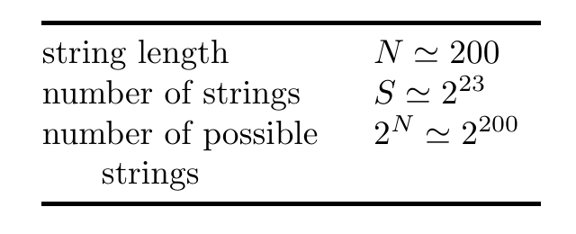

<!-- 源 PDF 物理页 205；原书印刷页 193。末段续至 PDF 206 页首，作为同一段保留。 -->

# 第 12 章　哈希码：用于高效信息检索的编码

> **编者导读（非原书正文）**　本章从按姓名查找记录的问题出发，比较几种检索方法的存储量和查询时间，再说明哈希码如何用较短的编码快速定位记录，以及出现碰撞时如何处理。

## 12.1　信息检索问题

信息检索问题的一个简单例子是提供电话簿查询服务：给定一个人的姓名，服务要回答（a）此人是否列在电话簿中；（b）此人的电话号码及其他详细信息。我们可以如下形式化这个问题，其中 $S$ 是电话簿中需要存储的姓名数量。

图 12.1　登场的主要量。图中文字依次为：字符串长度 $N\simeq200$；字符串数量 $S\simeq2^{23}$；可能的字符串总数 $2^N\simeq2^{200}$。

给定一份列表，其中有 $S$ 个长度为 $N$ 位的二进制字符串 $\{\mathbf x^{(1)},\ldots,\mathbf x^{(S)}\}$；$S$ 远小于可能的字符串总数 $2^N$。我们把 $\mathbf x^{(s)}$ 中的上标 $s$ 称为该字符串的*记录编号*。这里按客户加入电话簿的顺序给 $s$ 编号，$\mathbf x^{(s)}$ 是第 $s$ 位客户的姓名。为简单起见，假定所有人的姓名长度相同。姓名长度可以是 $N=200$ 位；如果要存储一千万位客户的资料，那么 $S\simeq10^7\simeq2^{23}$。我们暂且不考虑两位客户同名的可能性。

任务是建立从 $s$ 到 $\mathbf x^{(s)}$ 这一映射的逆映射：给定字符串 $\mathbf x$，若存在 $\mathbf x=\mathbf x^{(s)}$，系统就返回相应的 $s$；否则报告不存在这样的 $s$。（得到记录编号后，就可以在另一块存有电话号码的存储器中，到位置 $s$ 查出所需号码。）解决这个问题的目标，是尽量减少两类计算资源：存储从 $\mathbf x$ 到 $s$ 的逆映射所需的内存，以及计算逆映射所需的时间。最好还能让系统以很少的计算时间把新的字符串加入电话簿。

### 一些标准做法

解决信息检索问题，最简单、也最笨的两种办法是查找表和原始列表。

**查找表**是一块大小为 $2^N\log_2 S$ 的存储空间；其中 $\log_2 S$ 是存储从 $1$ 到 $S$ 的一个整数所需的位数。在 $2^N$ 个位置中，除了与字符串 $\mathbf x^{(s)}$ 对应的位置 $\mathbf x$ 写入 $s$，其余位置均置零。

查找表简单而快速，但前提是有足够的内存，而且从内存中读取条目的代价不随内存大小而变化。然而，在这里定义的问题中，$N$ 约为 $200$ 位或更多，所需的存储空间因此达到 $2^{200}$ 的量级；这种办法根本不可行。请记住，太阳系中的粒子数也不过约为 $2^{190}$。
