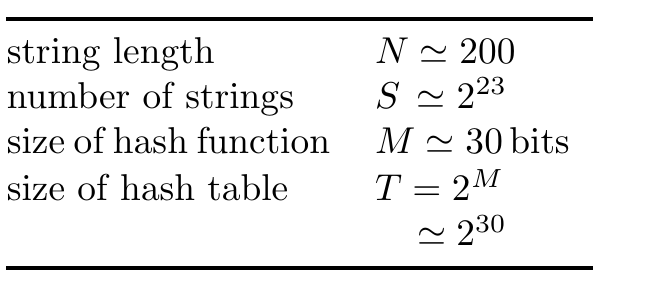

<!-- 源 PDF 物理页 207；原书印刷页 195。页首是 PDF 206 末段的续文，已在前页合为原书同一段。 -->

第二次是在信道编码中，我们把位串映射到不同维度的位串。当时研究的码把 $K$ 位映射为 $N$ 位，其中 $N$ 大于 $K$；我们利用随机码在理论上取得了进展。

哈希码把这两种想法结合起来。我们将研究把 $N$ 位映射为 $M$ 位的随机码，其中 $M$ 小于 $N$。

我们想把原来高维的空间映射到较低维的空间；在这个低维空间里，刚才被我们否决的笨办法——查找表——就能够实现了。

## 12.2　哈希码

我们先说明哈希码如何工作，再研究理想化哈希码的性质。哈希码借助一种称为*哈希函数*（hash function）的伪随机函数，解决从 $\mathbf x$ 到 $s$ 的信息检索问题。哈希函数把 $N$ 位字符串 $\mathbf x$ 映射为 $M$ 位字符串 $\mathbf h(\mathbf x)$，其中 $M<N$。通常选取 $M$，使“表的大小”$T\simeq2^M$ 略大于 $S$，比如大十倍。举例说，如果预计 $S$ 约为一百万，就可以把 $\mathbf x$ 映射成 30 位的哈希值 $\mathbf h$，而不论每条记录 $\mathbf x$ 的长度 $N$ 是多少。哈希函数是某个固定的确定性函数；理想情况下，它的表现应与固定的随机码无法区分。为了实际使用，还必须能迅速计算哈希函数。

图 12.2　修订后的主要量一览。图中文字依次为：字符串长度 $N\simeq200$；字符串数量 $S\simeq2^{23}$；哈希函数的大小 $M\simeq30$ 位；哈希表的大小 $T=2^M\simeq2^{30}$。

下面是两个简单的哈希函数例子：

**除法。** 表的大小 $T$ 取一个素数，最好不要接近 2 的幂。把整数 $\mathbf x$ 除以 $T$，所得余数就是哈希值。

**可变长度字符串加法。** 这种方法假定 $\mathbf x$ 是一个字节串，且表的大小 $T$ 为 256。将 $\mathbf x$ 的各个字符相加，再对 256 取模。这个哈希函数有一个缺点：由相同字母重新排列构成的字符串会被映射到同一个哈希值。

一种改进方法是，每加上一个字符后，都让累计值经过一个固定的伪随机置换。表的大小不超过 65,536 时，*可变长度字符串异或法*会以这种方式对字符串计算两次哈希，初始累计值分别设为 0 和 1（算法 12.3），最终得到一个 16 位哈希值。

选定哈希函数 $\mathbf h(\mathbf x)$ 后，我们可以如下建立信息检索系统。（见图 12.4。）

**编码。** 建立一块称为*哈希表*的存储空间，其大小为 $2^M b$ 个内存单位，其中 $b$ 是表示 0 到 $S$ 之间一个整数所需的存储量。起初，表中各处均置零。将每个存储的字符串 $\mathbf x^{(s)}$ 送入哈希函数，在哈希表中与所得向量 $\mathbf h^{(s)}=\mathbf h(\mathbf x^{(s)})$ 对应的位置写入整数 $s$；若该条目已被占用，$\mathbf x^{(s)}$ 与此前某个 $\mathbf x^{(s')}$ 就发生了*碰撞*（collision），因为它们恰好有相同的哈希码。碰撞可以用多种方法处理，稍后将讨论；我们先把基本流程说完。
