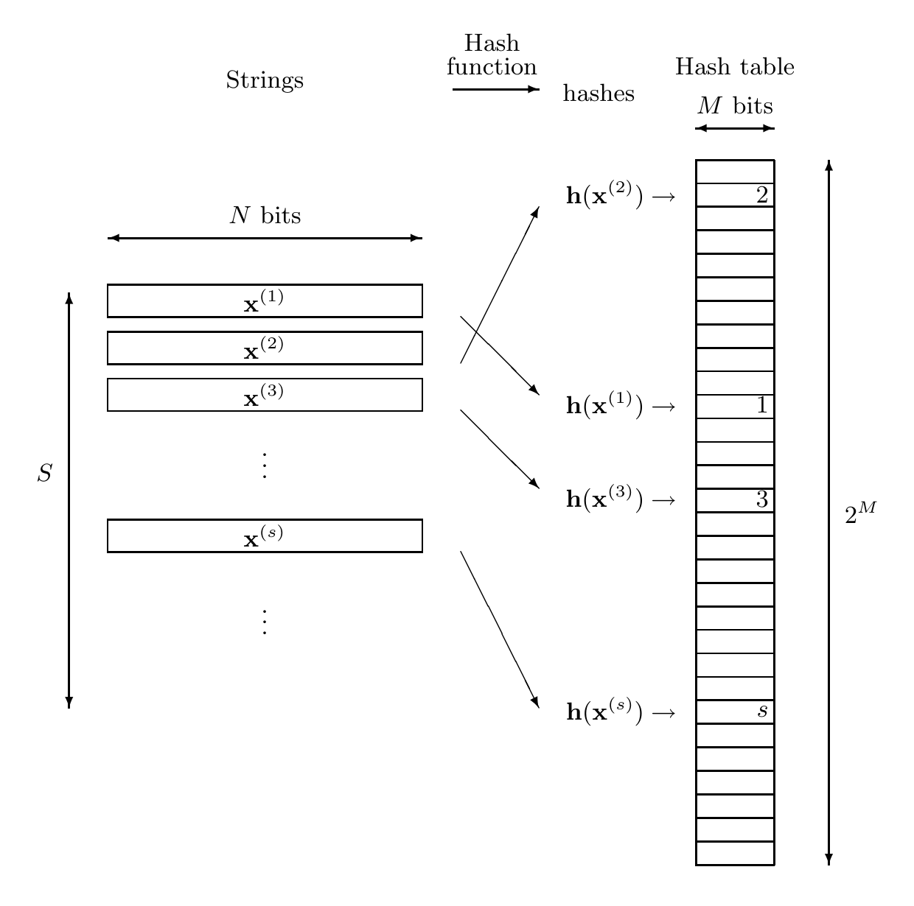

<!-- 源 PDF 物理页 208；原书印刷页 196 -->

**算法 12.3　可变长度字符串异或法的 C 语言实现。** 它从字符串 $\mathbf x$ 生成范围为 $0$ 至 $65{,}535$ 的哈希值 $h$。作者：Thomas Niemann。

```c
unsigned char Rand8[256];     // This array contains a random
                              // permutation from 0..255 to 0..255

int Hash(char *x) {            // x is a pointer to the first char;
    int h;                    //   *x is the first character
    unsigned char h1, h2;

    if (*x == 0) return 0;   // Special handling of empty string
    h1 = *x; h2 = *x + 1;    // Initialize two hashes
    x++;                    // Proceed to the next character
    while (*x) {
        h1 = Rand8[h1 ^ *x]; // Exclusive-or with the two hashes
        h2 = Rand8[h2 ^ *x]; //   and put through the randomizer
        x++;
    }                        // End of string is reached when *x=0
    h = ((int)(h1)<<8) |     // Shift h1 left 8 bits and add h2
         (int) h2 ;
    return h ;               // Hash is concatenation of h1 and h2
}
```

> **代码排版译注（非原书正文）**　原书把 `Rand8` 的英文注释折成两行，续行没有再次印出 `//`。这里为保持 C 代码可直接复制，在续行补了 `//`；注释文字和程序逻辑均与原页相同。

代码注释译文：`Rand8` 数组存放从 0–255 到 0–255 的一个随机置换；`x` 指向首字符，`*x` 是该字符。空字符串单独处理；`h1` 和 `h2` 初始化后，指针移到下一字符。循环中，当前字符分别与两个哈希状态异或，再经随机置换；遇到 `*x=0` 时字符串结束。最后把 `h1` 左移 8 位并与 `h2` 合并，所得哈希值是二者的串接。



图 12.4　用哈希函数进行信息检索。对每个字符串 $\mathbf x^{(s)}$，计算哈希值 $\mathbf h=\mathbf h(\mathbf x^{(s)})$，并把 $s$ 写到哈希表的第 $\mathbf h$ 行。哈希表中的空行存储零。表的大小为 $T=2^M$。图中文字依次为：“字符串”（Strings），长度 $N$ 位，共 $S$ 条；“哈希函数”（Hash function）产生“哈希值”（hashes）；“哈希表”（Hash table）的行地址为 $M$ 位，共 $2^M$ 行。图中示例为 $\mathbf x^{(1)}\mapsto1$、$\mathbf x^{(2)}\mapsto2$、$\mathbf x^{(3)}\mapsto3$ 和 $\mathbf x^{(s)}\mapsto s$，箭头在表中按各自哈希值定位。
