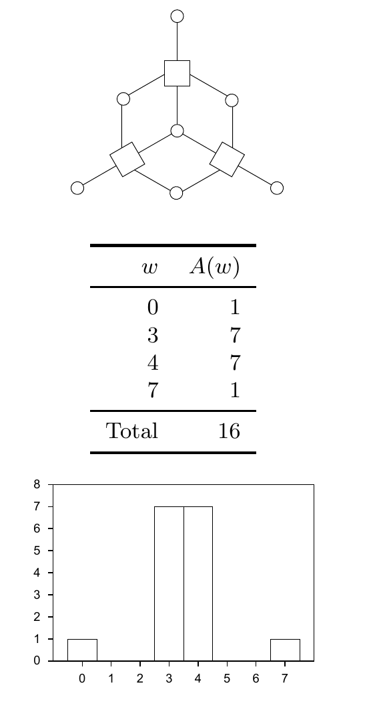

<!-- 源 PDF 物理页 218；原书印刷页 206 -->

# 第 13 章　二元码

> **编者导读（非原书正文）**　本章先用码字间距离和码字重量描述二元码，再考察只凭最小距离设计纠错码能保证什么，以及这种做法与有噪信道上可靠通信的目标有什么差别。

我们已经为输入、输出字符表任意的一般信道建立了 Shannon 的有噪信道编码定理。编码理论中的大量研究则集中在输入为二元值的信道这一特殊情形；首先会想到的信道是二元对称信道。

对于二元对称信道，一个码的最优译码器会找出与接收向量最接近的码字，也就是 Hamming 距离最小的码字。两个二元向量之间的 Hamming 距离，是两者取值不同的坐标数。如果噪声使发送的码字 $\mathbf t$ 变成接收向量 $\mathbf r$，而 $\mathbf r$ 与另一个码字更近，就会发生译码错误。因此，码字之间的距离与译码错误的概率有关。

> **原书页边例子。** `00001111` 与 `11001101` 之间的 Hamming 距离为 $3$。

## 13.1　码的距离性质

一个码的**距离**，是其任意两个码字之间的最小距离。

**例 13.1。** $(7,4)$ Hamming 码（原书印刷页 8）的距离为 $d=3$。任意两个码字至少有 $3$ 位不同。它能够保证纠正的最大差错数是 $t=1$；一般而言，距离为 $d$ 的码能保证纠正任意不超过 $\lfloor(d-1)/2\rfloor$ 个差错的图案。

“距离”更准确的名称是码的*最小距离*。码的距离通常记为 $d$ 或 $d_{\min}$。

现在只考虑线性码。在线性码中，所有码字的距离性质相同，因此，只要统计各码字到全零码字的距离，就能概括这个码所有码字之间的距离。

一个码的*重量枚举函数*（weight enumerator function）$A(w)$，定义为这个码中重量为 $w$ 的码字数。重量枚举函数也称为码的*距离分布*（distance distribution）。

**例 13.2。** 图 13.1 和图 13.2 给出了 $(7,4)$ Hamming 码与十二面体码的重量枚举函数。

图 13.1　$(7,4)$ Hamming 码的图，以及它的重量枚举函数。图内表格逐行为：$w=0$ 时 $A(w)=1$；$w=3$ 时为 $7$；$w=4$ 时为 $7$；$w=7$ 时为 $1$；合计 $16$ 个码字。下方柱状图的横轴为重量 $w=0,1,\ldots,7$，纵轴为 $A(w)$，四根非零柱分别位于 $0,3,4,7$。

## 13.2　对距离的执着

一个码保证能够纠正的最大差错数 $t$，与其距离 $d$ 满足 $t=\lfloor(d-1)/2\rfloor$。因此，许多编码理论家把注意力放在码的距离上，寻找在给定码大小下距离尽可能大的码。很多实用编码理论研究也集中于这样的译码器：对重量不超过码的“半距离”$t$ 的所有差错图案，都能完成最优译码。

> **原书页边说明。** 若 $d$ 为奇数，则 $d=2t+1$；若 $d$ 为偶数，则 $d=2t+2$。
